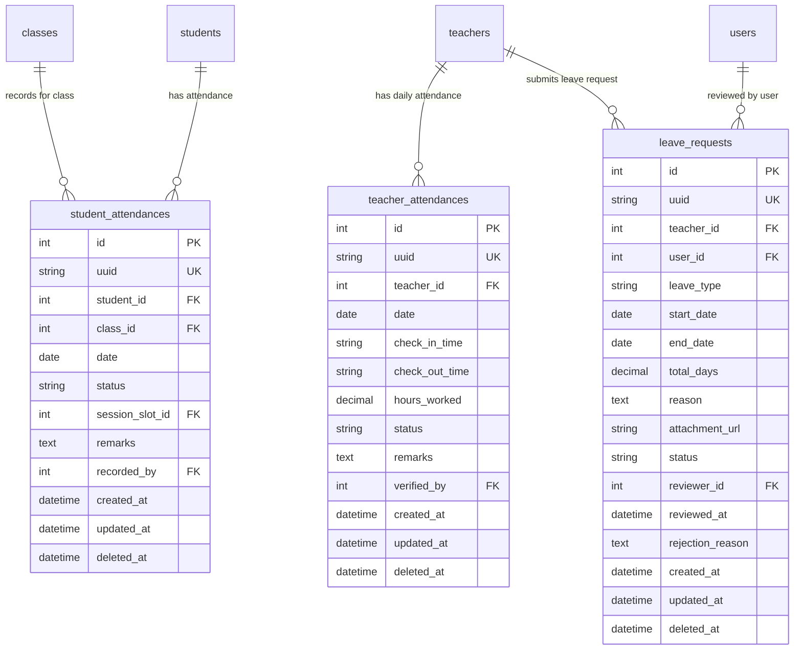

# Feature Spec: Attendance Management, Interactive Sheet Matrix & Leave Requests

## 1. Goal & Context
Build an end-to-end **Attendance Management, Interactive Sheet Matrix & Leave Request System** across shared contracts (`packages/contracts`), backend API (`apps/api`), and frontend admin web (`apps/web`).

This feature solves daily school operational bottlenecks for administrators, academic coordinators, teachers, and staff:
1. **Interactive Sheet-Like Student Attendance Matrix**:
   - Deliver an intuitive, Excel/Google Sheets-like interactive grid where teachers and administrators select a Class, Academic Year/Term, and Date (or Month/Date range) to take and review attendance effortlessly.
   - Support single-click rapid status toggling (`PRESENT`, `ABSENT`, `LATE`, `EXCUSED`), quick key shortcuts (`P`, `A`, `L`, `E`), bulk actions ("Mark All Present", "Clear All"), per-student remarks, and real-time attendance rate percentages.
2. **Teacher Attendance & Work Hour Tracking**:
   - Record and verify daily teacher attendance, check-in / check-out times, and actual teaching/working hours mapped to their assigned classes and timetable schedules.
   - Directly integrate with `teachers.salary_in_hour` and legacy `teacher_absences` domain to feed verified hours into the upcoming HR & Payroll feature.
3. **Leave & Absence Request Workflow (Teacher Scope)**:
   - Provide a streamlined leave request workflow exclusively for **Teachers** (per school operations requirement).
   - Support leave categories (`SICK`, `CASUAL`, `MATERNITY`, `BEREAVEMENT`, `UNPAID`, `OFFICIAL`, `OTHER`), document attachments, multi-day ranges, and administrative review (`PENDING`, `APPROVED`, `REJECTED`, `CANCELLED`).
   - Automatically synchronize approved leave requests into daily teacher attendance rosters as `ON_LEAVE`.

---

## 2. Requirements & Domain Modeling

### 2.1 Database Entities



#### 1. `student_attendances` Table
*Stores daily/session attendance records for enrolled students in a class.*

| Column (`snake_case`) | Type | Nullable | Default | TypeScript Property (`camelCase`) | Description & Constraints |
| :--- | :--- | :--- | :--- | :--- | :--- |
| `id` | `INT` | NO | AUTO_INCREMENT | `id: number` | Primary key |
| `uuid` | `VARCHAR(36)` | NO | (UUIDv4) | `uuid: string` | Unique system UUID |
| `student_id` | `INT` | NO | NULL | `studentId: number` | FK $\rightarrow$ `students.id` (CASCADE on delete) |
| `class_id` | `INT` | NO | NULL | `classId: number` | FK $\rightarrow$ `classes.id` (CASCADE on delete) |
| `date` | `DATE` | NO | NULL | `date: string` | Attendance date (`YYYY-MM-DD`) |
| `status` | `VARCHAR(20)` | NO | 'PRESENT' | `status: AttendanceStatusEnum` | `PRESENT`, `ABSENT`, `LATE`, `EXCUSED`, `HALF_DAY` |
| `session_slot_id` | `INT` | YES | NULL | `sessionSlotId?: number` | Optional FK $\rightarrow$ `class_timetables.id` for slot-level tracking |
| `remarks` | `TEXT` | YES | NULL | `remarks?: string` | Note/reason (e.g. "Doctor appointment") |
| `recorded_by` | `INT` | YES | NULL | `recordedBy?: number` | User ID of recorder $\rightarrow$ `users.id` |
| `created_at` | `DATETIME` | YES | CURRENT_TIMESTAMP | `createdAt?: Date` | Creation timestamp |
| `updated_at` | `DATETIME` | YES | CURRENT_TIMESTAMP | `updatedAt?: Date` | Update timestamp |
| `deleted_at` | `DATETIME` | YES | NULL | `deletedAt?: Date \| null` | Soft delete timestamp |

*Unique Composite Index*: `idx_student_class_date_slot (student_id, class_id, date, session_slot_id)` ensures idempotent upserts.

---

#### 2. `teacher_attendances` Table
*Stores daily check-in/out, hours worked, and status for academic teachers.*

| Column (`snake_case`) | Type | Nullable | Default | TypeScript Property (`camelCase`) | Description & Legacy Mapping |
| :--- | :--- | :--- | :--- | :--- | :--- |
| `id` | `INT` | NO | AUTO_INCREMENT | `id: number` | Primary key (*legacy `teacher_absences.id`*) |
| `uuid` | `VARCHAR(36)` | NO | (UUIDv4) | `uuid: string` | Unique system UUID |
| `teacher_id` | `INT` | NO | NULL | `teacherId: number` | FK $\rightarrow$ `teachers.id` (CASCADE on delete) |
| `date` | `DATE` | NO | NULL | `date: string` | Attendance date (`YYYY-MM-DD`) |
| `check_in_time` | `VARCHAR(10)` | YES | NULL | `checkInTime?: string` | Check-in time (`HH:mm`, e.g. `07:25`) |
| `check_out_time` | `VARCHAR(10)` | YES | NULL | `checkOutTime?: string` | Check-out time (`HH:mm`, e.g. `11:35`) |
| `hours_worked` | `DECIMAL(5,2)` | NO | 0.00 | `hoursWorked: number` | Verified teaching/working hours |
| `status` | `VARCHAR(20)` | NO | 'PRESENT' | `status: AttendanceStatusEnum` | `PRESENT`, `ABSENT`, `LATE`, `HALF_DAY`, `ON_LEAVE` |
| `remarks` | `TEXT` | YES | NULL | `remarks?: string` | Specific remarks or incident log |
| `verified_by` | `INT` | YES | NULL | `verifiedBy?: number` | FK $\rightarrow$ `users.id` (Admin/Director reviewer) |
| `created_at` | `DATETIME` | YES | CURRENT_TIMESTAMP | `createdAt?: Date` | Creation timestamp |
| `updated_at` | `DATETIME` | YES | CURRENT_TIMESTAMP | `updatedAt?: Date` | Update timestamp |
| `deleted_at` | `DATETIME` | YES | NULL | `deletedAt?: Date \| null` | Soft delete timestamp |

*Unique Composite Index*: `idx_teacher_date (teacher_id, date)` ensures single daily record per teacher.

---

#### 3. `leave_requests` Table
*Stores teacher leave applications, reason details, attachments, and administrative approval workflow.*

| Column (`snake_case`) | Type | Nullable | Default | TypeScript Property (`camelCase`) | Description & Notes |
| :--- | :--- | :--- | :--- | :--- | :--- |
| `id` | `INT` | NO | AUTO_INCREMENT | `id: number` | Primary key |
| `uuid` | `VARCHAR(36)` | NO | (UUIDv4) | `uuid: string` | Unique system UUID |
| `teacher_id` | `INT` | NO | NULL | `teacherId: number` | Teacher FK $\rightarrow$ `teachers.id` |
| `user_id` | `INT` | YES | NULL | `userId?: number` | Submitter user account FK $\rightarrow$ `users.id` |
| `leave_type` | `VARCHAR(30)` | NO | 'CASUAL' | `leaveType: LeaveTypeEnum` | `SICK`, `CASUAL`, `MATERNITY`, `BEREAVEMENT`, `UNPAID`, `OFFICIAL`, `OTHER` |
| `start_date` | `DATE` | NO | NULL | `startDate: string` | Leave starting date (`YYYY-MM-DD`) |
| `end_date` | `DATE` | NO | NULL | `endDate: string` | Leave ending date (`YYYY-MM-DD`) |
| `total_days` | `DECIMAL(4,1)` | NO | 1.0 | `totalDays: number` | Total duration in days (e.g. `0.5`, `1.0`, `3.5`) |
| `reason` | `TEXT` | NO | NULL | `reason: string` | Detailed justification for the leave |
| `attachment_url` | `VARCHAR(500)`| YES | NULL | `attachmentUrl?: string` | Optional supporting document / medical slip |
| `status` | `VARCHAR(20)` | NO | 'PENDING' | `status: LeaveStatusEnum` | `PENDING`, `APPROVED`, `REJECTED`, `CANCELLED` |
| `reviewer_id` | `INT` | YES | NULL | `reviewerId?: number` | Reviewing admin FK $\rightarrow$ `users.id` |
| `reviewed_at` | `DATETIME` | YES | NULL | `reviewedAt?: Date` | Timestamp of approval/rejection |
| `rejection_reason`| `TEXT` | YES | NULL | `rejectionReason?: string` | Explanation if rejected |
| `created_at` | `DATETIME` | YES | CURRENT_TIMESTAMP | `createdAt?: Date` | Creation timestamp |
| `updated_at` | `DATETIME` | YES | CURRENT_TIMESTAMP | `updatedAt?: Date` | Update timestamp |
| `deleted_at` | `DATETIME` | YES | NULL | `deletedAt?: Date \| null` | Soft delete timestamp |

---

## 3. Tech Design & File Scope

### 3.1 `@repo/contracts` (`packages/contracts`)

1. **Enums**:
   - `packages/contracts/src/attendance-status.enum.ts`:
     - `AttendanceStatusEnum`: `PRESENT = "PRESENT"`, `ABSENT = "ABSENT"`, `LATE = "LATE"`, `EXCUSED = "EXCUSED"`, `HALF_DAY = "HALF_DAY"`, `ON_LEAVE = "ON_LEAVE"`
     - `LeaveTypeEnum`: `SICK = "SICK"`, `CASUAL = "CASUAL"`, `MATERNITY = "MATERNITY"`, `BEREAVEMENT = "BEREAVEMENT"`, `UNPAID = "UNPAID"`, `OFFICIAL = "OFFICIAL"`, `OTHER = "OTHER"`
     - `LeaveStatusEnum`: `PENDING = "PENDING"`, `APPROVED = "APPROVED"`, `REJECTED = "REJECTED"`, `CANCELLED = "CANCELLED"`
2. **DTO Schemas (`packages/contracts/src/attendance.dto.ts` & `leave-request.dto.ts`)**:
   - **Student Attendance**:
     - `StudentAttendanceSchema`: Individual attendance record schema.
     - `RecordStudentAttendanceSchema`: Single student update payload (`studentId`, `classId`, `date`, `status`, `remarks`, `sessionSlotId`).
     - `BatchRecordStudentAttendanceItemSchema` & `BatchRecordStudentAttendanceSchema`: Bulk matrix save payload (`classId`, `date`, `records: { studentId, status, remarks }[]`).
     - `FindStudentAttendanceSchema`: Query filter (`classId`, `date`, `startDate`, `endDate`, `status`, `page`, `pageSize`).
     - `StudentAttendanceMatrixSchema`: Full sheet payload returning roster of enrolled students and daily status map for the chosen month/range.
     - `ClassAttendanceSummarySchema`: Class-level statistics (Total enrolled, Present count, Absent count, Late count, Excused count, Overall % attendance rate).
   - **Teacher Attendance**:
     - `TeacherAttendanceSchema`: Teacher attendance record schema with joined teacher details and `hoursWorked`.
     - `RecordTeacherAttendanceSchema`: Daily payload (`teacherId`, `date`, `checkInTime`, `checkOutTime`, `hoursWorked`, `status`, `remarks`).
     - `BatchRecordTeacherAttendanceSchema`: Bulk daily teacher check-in payload.
     - `FindTeacherAttendanceSchema`: Query filters (`teacherId`, `date`, `startDate`, `endDate`, `status`, `page`, `pageSize`).
     - `TeacherAttendanceSummarySchema`: Aggregate monthly totals (Total teaching hours, days present, absences, late arrivals, on-leave days).
   - **Leave Requests**:
     - `LeaveRequestSchema`: Complete leave application schema with teacher names and reviewer details.
     - `CreateLeaveRequestSchema`: Submission payload with validation (`endDate >= startDate`, `totalDays > 0`, `reason.min(3)`).
     - `UpdateLeaveRequestSchema`: Edit payload (allowed when `status === PENDING`).
     - `ReviewLeaveRequestSchema`: Decision payload (`status: 'APPROVED' | 'REJECTED'`, `rejectionReason?: string`, `syncAttendance?: boolean`).
     - `FindLeaveRequestsSchema`: Query filters (`teacherId`, `leaveType`, `status`, `startDate`, `endDate`, `search`, `page`, `pageSize`).
3. **API Route Constants (`packages/contracts/src/route.ts`)**:
   ```typescript
   ATTENDANCE: {
     STUDENTS: '/api/v1/admin/attendance/students',
     STUDENTS_BATCH: '/api/v1/admin/attendance/students/batch',
     STUDENT_SHEET_MATRIX: '/api/v1/admin/attendance/students/matrix',
     STUDENT_SUMMARY: '/api/v1/admin/attendance/students/summary',
     TEACHERS: '/api/v1/admin/attendance/teachers',
     TEACHERS_BATCH: '/api/v1/admin/attendance/teachers/batch',
     TEACHER_SUMMARY: '/api/v1/admin/attendance/teachers/summary',
     LEAVE_REQUESTS: '/api/v1/admin/attendance/leave-requests',
     LEAVE_REQUEST_CREATE: '/api/v1/admin/attendance/leave-requests',
     LEAVE_REQUEST_GET: '/api/v1/admin/attendance/leave-requests/:id',
     LEAVE_REQUEST_UPDATE: '/api/v1/admin/attendance/leave-requests/:id',
     LEAVE_REQUEST_DELETE: '/api/v1/admin/attendance/leave-requests/:id',
     LEAVE_REQUEST_REVIEW: '/api/v1/admin/attendance/leave-requests/:id/review',
   }
   ```
4. **Resource Enum (`packages/contracts/src/resource.enum.ts`)**:
   - `ResourceEnum.ATTENDANCE = "attendance"`

---

## 4. Backend API (`apps/api`)

1. **Database Migrations & Seeders**:
   - `apps/api/database/migrations/2026.08.17T04.00.01.create-student_attendances-table.ts`
   - `apps/api/database/migrations/2026.08.17T04.00.02.create-teacher_attendances-table.ts`
   - `apps/api/database/migrations/2026.08.17T04.00.03.create-leave_requests-table.ts`
   - `apps/api/database/seeds/2026.08.17T04.00.00.attendance-seeder.ts`: Multi-state sample records (Students present/absent across active classes, teacher daily logs with hours, and pending/approved/rejected leave requests).
2. **Entities**:
   - `apps/api/src/attendance/entity/student-attendance.entity.ts`
   - `apps/api/src/attendance/entity/teacher-attendance.entity.ts`
   - `apps/api/src/attendance/entity/leave-request.entity.ts`
3. **DTOs & Mappers**:
   - `apps/api/src/attendance/dto/student-attendance.dto.ts`
   - `apps/api/src/attendance/dto/teacher-attendance.dto.ts`
   - `apps/api/src/attendance/dto/leave-request.dto.ts`
   - `apps/api/src/attendance/mapper/attendance.mapper.ts`: Maps pure entities to `@repo/contracts` DTOs with decimal number conversions and student/teacher names.
4. **CASL Security & Filter Hooks**:
   - `apps/api/src/attendance/attendance.hook.ts`: `SubjectBeforeFilterHook` for parameterized endpoints.
   - `apps/api/src/attendance/attendance.permission.ts`: Role capabilities (`teacher` role can record student attendance for assigned classes; `admin`/`cms` can manage all; `student` can view own attendance).
5. **Services & Controllers**:
   - `apps/api/src/attendance/student-attendance.service.ts`: Batch upserts, date-range matrix calculations, class summaries.
   - `apps/api/src/attendance/teacher-attendance.service.ts`: Daily teacher check-ins, bulk logs, teaching hour accumulations.
   - `apps/api/src/attendance/leave-request.service.ts`: CRUD, status transitions, and automated sync creating `ON_LEAVE` attendance records upon approval.
   - `apps/api/src/attendance/admin.attendance.controller.ts`: REST endpoints with `@UseGuards(JwtAuthGuard, CaslGuard)`.
   - `apps/api/src/attendance/attendance.module.ts`: NestJS module registering entities, services, hooks, and controller.
6. **Testing**:
   - `apps/api/src/attendance/student-attendance.service.spec.ts`: Unit tests covering all 6 condition categories (8 tests).
   - `apps/api/src/attendance/teacher-attendance.service.spec.ts`: Unit tests covering all 6 condition categories (4 tests).
   - `apps/api/src/attendance/leave-request.service.spec.ts`: Unit tests covering approval workflow and edge cases (6 tests).
   - `apps/api/test/attendance.e2e-spec.ts`: End-to-end integration tests for all student, teacher, and leave request APIs with auth and RBAC (15 tests).

---

## 5. Frontend Web (`apps/web`)

1. **Feature Module (`apps/web/src/features/attendance/`)**:
   - **Hooks**:
     - `hooks/use-student-attendance.ts`: Queries class sheet matrix data, summary KPIs, and batch upsert mutation.
     - `hooks/use-teacher-attendance.ts`: Queries teacher daily rosters, monthly summaries, and batch upsert mutation.
     - `hooks/use-leave-requests.ts`: Infinite query for leave requests table, detail query, and create/update/review/delete mutations.
   - **Components**:
     - `components/student-attendance-sheet.tsx`:
       - **Sheet Matrix Core**: Spreadsheet-style table with sticky student name/ID columns and date columns.
       - **Interactive Cell Toggle**: Quick click to cycle status (`Present` $\rightarrow$ `Absent` $\rightarrow$ `Late` $\rightarrow$ `Excused` $\rightarrow$ `Half Day`) or keyboard shortcuts (`P`, `A`, `L`, `E`, `H`).
       - **Batch Action Toolbar**: "Mark All Present", "Save Changes" (with dirty state tracking).
       - **Summary Bar**: Real-time stats header showing Total Enrolled, Present %, Absent %, Late %, Excused %.
     - `components/teacher-attendance-table.tsx`:
       - Daily teacher roster table with Check-in / Check-out time pickers, calculated hours worked, status badges, and quick verification button.
       - Quick action: "Fill Standard Shift (4h)".
     - `components/leave-request-list-table.tsx`:
       - Filterable list table for leave requests with teacher name, teacher code, date range, total days, status badge (`Pending`, `Approved`, `Rejected`), and action triggers.
     - `components/leave-request-form-dialog.tsx`:
       - Modal for submitting a leave request with teacher selection (if admin), date range picker, automatic total days calculation, leave type dropdown, and reason text area.
     - `components/review-leave-dialog.tsx`:
       - Modal for approving or rejecting leave requests with rejection reason input and auto-attendance sync toggle.
     - `components/attendance-status-badge.tsx`: Color-coded status badges (`PRESENT`: Emerald, `ABSENT`: Rose, `LATE`: Amber, `EXCUSED`: Blue, `HALF_DAY`: Purple, `ON_LEAVE`: Indigo).
2. **Page Views & Router Integration**:
   - `apps/web/src/routes/student-attendance-page.tsx` $\rightarrow$ `/attendance/students`
   - `apps/web/src/routes/teacher-attendance-page.tsx` $\rightarrow$ `/attendance/teachers`
   - `apps/web/src/routes/leave-requests-page.tsx` $\rightarrow$ `/attendance/leave-requests`
   - `apps/web/src/routes/router.tsx`: Protected routes wrapped in `<PermissionRoute resource="attendance" action="read">`.

---

## 6. Acceptance Criteria & Verification Matrix

- [x] **Contracts**:
  - [x] Shared Zod schemas, DTOs, route constants, and enums defined in `@repo/contracts`.
  - [x] `pnpm --filter @repo/contracts build` passes with zero errors.
- [x] **Database & Migrations**:
  - [x] Umzug migrations for `student_attendances`, `teacher_attendances`, and `leave_requests` execute cleanly (`up` and `down`).
  - [x] Multi-state seed fixtures populated with realistic student attendance, teacher work logs, and leave requests.
- [x] **Backend API (`apps/api`)**:
  - [x] REST endpoints for student attendance (single, batch, matrix, summary).
  - [x] REST endpoints for teacher attendance (single, batch, monthly summary).
  - [x] REST endpoints for leave requests (create, update, cancel, approve/reject review).
  - [x] CASL permission guards and hooks properly enforce role limits.
  - [x] Unit test suite passes covering all condition categories (**18/18 tests passing**).
  - [x] E2E test suite passes via `pnpm --filter api test:e2e test/attendance.e2e-spec.ts` (**15/15 tests passing**).
- [x] **Frontend Web (`apps/web`)**:
  - [x] Sheet-like interactive matrix grid for student attendance with rapid click/key status cycling, bulk mark, dirty state, and statistics header.
  - [x] Teacher daily check-in/out roster and monthly hours overview.
  - [x] Leave requests list table, submission dialog, and approval/rejection dialog.
  - [x] Sidebar links under `/attendance/students`, `/attendance/teachers`, `/attendance/leave-requests` fully operational.
  - [x] Component unit tests pass (**16/16 tests passing**).
  - [x] Production build passes with zero TypeScript or linter errors (`pnpm --filter web build` exit 0).
