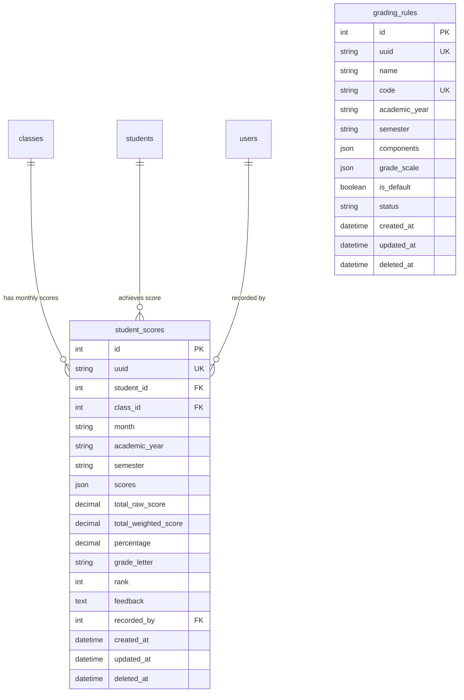

# Feature Spec: Monthly Gradebook Matrix & Configurable Grading Rules

## 1. Goal & Context
Build a streamlined, end-to-end **Monthly Gradebook Matrix & Configurable Grading Rules System** across shared contracts (`packages/contracts`), backend API (`apps/api`), and frontend admin web (`apps/web`).

This module provides a direct, highly efficient monthly grading workflow mirroring the design of `student_attendances`:
1. **Streamlined Direct Schema (No Redundant Header Table)**:
   - Student monthly scores are identified directly by `student_id`, `class_id`, `month` (`YYYY-MM`), `academic_year`, and `semester`.
   - Eliminates intermediate session header tables for fast, atomic, idempotent score upserts.
2. **Admin-Configurable Master Grading Rules**:
   - Admins configure master scoring rules with custom evaluation components and weight distributions (e.g. `Reading = 5% [Max: 10]`, `Vocabulary = 30% [Max: 30]`, `Grammar = 15% [Max: 20]`, `Listening = 20% [Max: 20]`, `Speaking = 15% [Max: 10]`, `Homework = 15% [Max: 10]` totaling $100\%$).
   - Master rules define customizable grade threshold scales ($A$: 90–100%, $B$: 80–89%, $C$: 70–79%, $D$: 60–69%, $E$: 50–59%, $F$: <50%).
   - All classes in the system adhere to the active master rule for unified academic evaluation.
3. **Attendance-Style Monthly Filter & Instant Spreadsheet Matrix**:
   - Teachers and administrators select a **Class** and **Month** (`YYYY-MM`) from a top filter bar (matching the established Attendance Matrix pattern).
   - The interactive gradebook immediately populates with all enrolled students and editable score cells for each configured component.
4. **Interactive Excel-Like Spreadsheet Grid & Auto-Calculations**:
   - Rapid keyboard navigation (Arrow Up/Down/Left/Right, `Tab`, `Enter`).
   - Teachers enter **raw points** (e.g. 28/30 for Vocab, 9/10 for Reading).
   - Instant client-side auto-calculation of:
     - Component Weighted Scores: $\frac{\text{rawScore}}{\text{maxScore}} \times \text{weight}$
     - Total Weighted Score: $\sum \text{weightedScore}$ (out of $100\%$)
     - Percentage & Letter Grade Badge ($A, B, C, D, E, F$)
     - Class Rank ($1, 2, 3, \dots$ handling score ties)
   - Clean numeric score handling (blank or zero treated as 0 points) with an optional qualitative teacher feedback / remarks field per student.
   - One-click batch save (`/api/v1/admin/examinations/matrix/save`) to persist or update student monthly scores.
5. **Complete Reporting Suite & Transcripts**:
   - **CSV / Excel Export**: One-click download of the complete class monthly gradebook matrix.
   - **Printable Student Monthly Report Card**: A dedicated printable modal showing the student's monthly performance breakdown, class rank, attendance summary, teacher comments, and signature area.
   - **Class Summary Analytics**: Real-time summary cards displaying class average, highest/lowest scores, pass rate (%), and grade distribution breakdown ($A\text{--}F$).
6. **Dedicated Navigation & RBAC**:
   - Top-level sidebar item **"Exams & Grades"** (`/examinations`) with sub-items for **Gradebook Matrix** (`/examinations/gradebook`), **Report Cards** (`/examinations/report-cards`), and **Grading Rules** (`/examinations/rules`).
   - Teachers record scores for their assigned classes; Admins manage rules, view all classes, and export reports.

---

## 2. Requirements & Domain Modeling

### 2.1 Database Entities



---

#### 1. `grading_rules` Table
*Stores configurable master score breakdown schemes, component weights, max scores, and grade threshold scales.*

| Column (`snake_case`) | Type | Nullable | Default | TypeScript Property (`camelCase`) | Description & Constraints |
| :--- | :--- | :--- | :--- | :--- | :--- |
| `id` | `INT` | NO | AUTO_INCREMENT | `id: number` | Primary key |
| `uuid` | `VARCHAR(36)` | NO | (UUIDv4) | `uuid: string` | Unique system UUID |
| `name` | `VARCHAR(255)` | NO | NULL | `name: string` | Name (e.g. "Standard School Evaluation Scheme") |
| `code` | `VARCHAR(50)` | NO | NULL | `code: string` | Unique identifier code (e.g. `RULE-DEFAULT`) |
| `academic_year` | `VARCHAR(20)` | YES | '2025-2026' | `academicYear?: string` | Academic year (e.g. `2025-2026`) |
| `semester` | `VARCHAR(26)` | YES | 'SEMESTER_1' | `semester?: SemesterEnum` | `SEMESTER_1`, `SEMESTER_2`, `TERM_1`, `TERM_2`, etc. |
| `components` | `JSON` | NO | `[]` | `components: GradingRuleComponent[]` | Array of `{ id, name, maxScore, weight, description }` |
| `grade_scale` | `JSON` | NO | `[]` | `gradeScale: GradeScaleItem[]` | Array of `{ letter, minScore, maxScore, label }` |
| `is_default` | `BOOLEAN` | NO | TRUE | `isDefault: boolean` | Active master grading template |
| `status` | `VARCHAR(20)` | NO | 'ACTIVE' | `status: string` | `ACTIVE`, `INACTIVE`, `ARCHIVED` |
| `created_at` | `DATETIME` | YES | CURRENT_TIMESTAMP | `createdAt?: Date` | Creation timestamp |
| `updated_at` | `DATETIME` | YES | CURRENT_TIMESTAMP | `updatedAt?: Date` | Update timestamp |
| `deleted_at` | `DATETIME` | YES | NULL | `deletedAt?: Date \| null` | Soft-delete timestamp |

*Default Master Components (`GradingRuleComponent[]`)*:
```json
[
  { "id": "reading", "name": "Reading", "maxScore": 10, "weight": 5, "description": "Reading comprehension & fluency" },
  { "id": "vocab", "name": "Vocabulary", "maxScore": 30, "weight": 30, "description": "Vocabulary quiz & spelling" },
  { "id": "grammar", "name": "Grammar", "maxScore": 20, "weight": 15, "description": "Grammar rules & sentence structure" },
  { "id": "listening", "name": "Listening", "maxScore": 20, "weight": 20, "description": "Listening test & audio comprehension" },
  { "id": "speaking", "name": "Speaking", "maxScore": 10, "weight": 15, "description": "Oral presentation & fluency" },
  { "id": "homework", "name": "Homework & Attendance", "maxScore": 10, "weight": 15, "description": "Monthly participation & assignments" }
]
```
*(Sum of component weights: $5 + 30 + 15 + 20 + 15 + 15 = 100\%$)*

*Grade Scale Structure (`GradeScaleItem[]`)*:
```json
[
  { "letter": "A", "minScore": 90, "maxScore": 100, "label": "Excellent / ល្អប្រសើរ" },
  { "letter": "B", "minScore": 80, "maxScore": 89.99, "label": "Very Good / ល្អណាស់" },
  { "letter": "C", "minScore": 70, "maxScore": 79.99, "label": "Good / ល្អ" },
  { "letter": "D", "minScore": 60, "maxScore": 69.99, "label": "Fair / មធ្យម" },
  { "letter": "E", "minScore": 50, "maxScore": 59.99, "label": "Pass / ខ្សោយ" },
  { "letter": "F", "minScore": 0, "maxScore": 49.99, "label": "Fail / ធ្លាក់" }
]
```

---

#### 2. `student_scores` Table
*Stores itemized component scores, calculated weighted totals, letter grades, ranks, and qualitative remarks per student per class per month.*

| Column (`snake_case`) | Type | Nullable | Default | TypeScript Property (`camelCase`) | Description & Notes |
| :--- | :--- | :--- | :--- | :--- | :--- |
| `id` | `INT` | NO | AUTO_INCREMENT | `id: number` | Primary key |
| `uuid` | `VARCHAR(36)` | NO | (UUIDv4) | `uuid: string` | Unique system UUID |
| `student_id` | `INT` | NO | NULL | `studentId: number` | FK $\rightarrow$ `students.id` (CASCADE on delete) |
| `class_id` | `INT` | NO | NULL | `classId: number` | FK $\rightarrow$ `classes.id` (CASCADE on delete) |
| `month` | `VARCHAR(7)` | NO | NULL | `month: string` | Evaluation Month in format `YYYY-MM` (e.g. `2026-08`) |
| `academic_year` | `VARCHAR(20)` | NO | '2025-2026' | `academicYear: string` | Academic year (e.g. `2025-2026`) |
| `semester` | `VARCHAR(26)` | NO | 'SEMESTER_1' | `semester: SemesterEnum` | Semester / Term designation |
| `scores` | `JSON` | NO | `{}` | `scores: Record<string, number>` | Raw scores map: `{"reading": 9, "vocab": 28, ...}` |
| `total_raw_score` | `DECIMAL(6,2)` | NO | 0.00 | `totalRawScore: number` | Sum of raw points scored |
| `total_weighted_score` | `DECIMAL(6,2)`| NO | 0.00 | `totalWeightedScore: number`| Total weighted score out of 100% |
| `percentage` | `DECIMAL(5,2)` | NO | 0.00 | `percentage: number` | Percentage (0.00% - 100.00%) |
| `grade_letter` | `VARCHAR(5)` | NO | 'F' | `gradeLetter: string` | Assigned letter grade (`A`, `B`, `C`, `D`, `E`, `F`) |
| `rank` | `INT` | YES | NULL | `rank?: number` | Rank in class ($1, 2, \dots$ handling ties) |
| `feedback` | `TEXT` | YES | NULL | `feedback?: string` | Teacher's qualitative remarks / comments |
| `recorded_by` | `INT` | YES | NULL | `recordedBy?: number` | Grader FK $\rightarrow$ `users.id` (ON DELETE SET NULL) |
| `created_at` | `DATETIME` | YES | CURRENT_TIMESTAMP | `createdAt?: Date` | Creation timestamp |
| `updated_at` | `DATETIME` | YES | CURRENT_TIMESTAMP | `updatedAt?: Date` | Update timestamp |
| `deleted_at` | `DATETIME` | YES | NULL | `deletedAt?: Date \| null` | Soft-delete timestamp |

*Unique Composite Index*: `idx_score_student_class_month (student_id, class_id, month)` ensures idempotent upserts per student per class per month.

---

### 2.2 Shared Contracts (`@repo/contracts`)

#### 1. DTO Schemas (`packages/contracts/src/examination.dto.ts`)
- `GradingRuleComponentSchema`:
  ```typescript
  export const GradingRuleComponentSchema = z.object({
    id: z.string(),
    name: z.string().min(1, 'Name is required'),
    maxScore: z.coerce.number().positive('Max score must be greater than 0'),
    weight: z.coerce.number().min(0).max(100),
    description: z.string().optional(),
  });
  ```
- `GradeScaleItemSchema`:
  ```typescript
  export const GradeScaleItemSchema = z.object({
    letter: z.string(),
    minScore: z.coerce.number().min(0),
    maxScore: z.coerce.number().max(100),
    label: z.string(),
  });
  ```
- `GradingRuleSchema`: Full grading rule schema with validation.
- `CreateGradingRuleSchema` / `UpdateGradingRuleSchema`: Refined with `.refine((data) => Math.abs(data.components.reduce((sum, c) => sum + c.weight, 0) - 100) < 0.01, { message: "Component weights must sum to exactly 100%" })`.
- `GetGradebookMatrixSchema`: Filter query with `classId: number`, `month: string` (regex `/^\d{4}-\d{2}$/`).
- `SaveGradebookScoreItemSchema`: `{ studentId: number, scores: Record<string, number>, feedback?: string }`.
- `BatchSaveGradebookSchema`: `{ classId: number, month: string, scores: SaveGradebookScoreItemSchema[] }`.
- `GradebookMatrixRowSchema`:
  ```typescript
  export const GradebookMatrixRowSchema = z.object({
    studentId: z.number(),
    studentCode: z.string().nullable().optional(),
    firstName: z.string(),
    lastName: z.string(),
    firstNameKm: z.string().nullable().optional(),
    lastNameKm: z.string().nullable().optional(),
    gender: z.string().default('MALE'),
    scores: z.record(z.string(), z.number()),
    totalRawScore: z.number().default(0),
    totalWeightedScore: z.number().default(0),
    percentage: z.number().default(0),
    gradeLetter: z.string().default('F'),
    rank: z.number().optional().nullable(),
    feedback: z.string().optional().nullable(),
  });
  ```
- `GradebookMatrixSchema`: `{ classId: number, className: string, month: string, academicYear: string, semester: string, gradingRule: GradingRuleDto, rows: GradebookMatrixRowSchema[], classStats: ClassGradeStatsDto }`.
- `ClassGradeStatsDto`: `{ totalStudents: number, gradedCount: number, averageScore: number, highestScore: number, lowestScore: number, passCount: number, failCount: number, passRate: number, gradeDistribution: Record<string, number> }`.
- `StudentReportCardSchema`: Complete transcript data model for single-student monthly progress report cards.

#### 2. API Route Constants (`packages/contracts/src/route.ts`)
```typescript
export const API_ROUTE = {
  // ...
  EXAMINATION: {
    RULES_LIST: '/api/v1/admin/examinations/rules',
    RULES_CREATE: '/api/v1/admin/examinations/rules',
    RULES_GET: '/api/v1/admin/examinations/rules/:id',
    RULES_UPDATE: '/api/v1/admin/examinations/rules/:id',
    RULES_DELETE: '/api/v1/admin/examinations/rules/:id',
    RULES_DEFAULT: '/api/v1/admin/examinations/rules/default',
    MATRIX: '/api/v1/admin/examinations/matrix',
    GRADEBOOK_SAVE: '/api/v1/admin/examinations/matrix/save',
    REPORT_CARD: '/api/v1/admin/examinations/report-card/:studentId',
    EXPORT_CSV: '/api/v1/admin/examinations/matrix/export',
  },
};
```

---

## 3. Tech Design & File Scope

### 3.1 Backend Architecture (`apps/api`)

```
apps/api/
├── database/
│   ├── migrations/
│   │   ├── 2026.08.18T00.00.01.create-grading_rules-table.ts
│   │   └── 2026.08.18T00.00.02.create-student_scores-table.ts
│   └── seeds/
│       └── 2026.08.18T00.00.00.examination-and-grading-seeder.ts
├── src/
│   └── examination/
│       ├── entity/
│       │   ├── grading-rule.entity.ts
│       │   └── student-score.entity.ts
│       ├── dto/
│       │   ├── grading-rule.dto.ts
│       │   └── gradebook.dto.ts
│       ├── mapper/
│       │   ├── grading-rule.mapper.ts
│       │   └── gradebook.mapper.ts
│       ├── admin.grading-rule.controller.ts
│       ├── admin.examination.controller.ts
│       ├── grading-rule.service.ts
│       ├── examination.service.ts
│       ├── examination.permission.ts
│       └── examination.module.ts
└── test/
    ├── examination.service.spec.ts
    ├── grading-rule.service.spec.ts
    └── examination.e2e-spec.ts
```

### 3.2 Frontend Architecture (`apps/web`)

```
apps/web/src/
├── features/
│   └── examinations/
│       ├── components/
│       │   ├── examination-filter-bar.tsx       # Class & Month selector
│       │   ├── gradebook-matrix.tsx             # Interactive spreadsheet grid with keyboard navigation
│       │   ├── gradebook-toolbar.tsx            # Save, Export CSV, Print Report Card triggers
│       │   ├── grading-rule-list-table.tsx      # Admin master rules table
│       │   ├── grading-rule-form-dialog.tsx     # Dynamic modal for editing components & weights
│       │   ├── student-report-card-modal.tsx    # Printable student monthly report card
│       │   └── grade-analytics-cards.tsx        # Class average, pass rate, grade distribution
│       ├── hooks/
│       │   ├── use-gradebook-matrix-query.ts    # Fetches matrix roster for selected class & month
│       │   ├── use-save-gradebook-mutation.ts   # Batch saves student scores with toast feedback
│       │   ├── use-grading-rules-query.ts       # Rules query & mutation hooks
│       │   └── use-student-report-card-query.ts # Single student report card query
│       └── index.ts
├── routes/
│   ├── gradebook-page.tsx                      # Gradebook Matrix page (/examinations/gradebook)
│   ├── grading-rules-page.tsx                  # Master Grading Rules manager page (/examinations/rules)
│   ├── report-cards-page.tsx                   # Student Report Cards page (/examinations/report-cards)
│   └── router.tsx                              # Route definitions under ProtectedLayout
```

---

## 4. Testing & Quality Assurance Plan

### 4.1 All 6 Condition Categories
1. **Happy Path (200 / 201)**:
   - Create and update master grading rule with components summing to 100%.
   - Load gradebook matrix for class and month: loads enrolled students with active component columns.
   - Batch save student scores: correctly calculates total weighted score, percentage, assigns letter grade ($A\text{--}F$), and determines correct class ranks.
   - Export CSV and fetch student report card.
2. **Validation Failures (400 Bad Request)**:
   - Component weights sum $\neq 100\%$ rejected with clear error.
   - Raw score exceeding component `maxScore` rejected.
   - Negative scores or non-numeric inputs rejected.
   - Invalid month string (e.g. `2026-15`) rejected.
3. **Duplicate & Uniqueness Conflicts (409 Conflict)**:
   - Duplicate grading rule code rejected.
4. **Resource Not Found & Invalid State (404 / 422)**:
   - Requesting matrix for non-existent class ID returns 404.
5. **Authentication & Authorization (401 / 403)**:
   - Unauthenticated requests blocked.
   - Teachers restricted to scoring classes they teach; Admins can access all classes.
6. **Edge & Boundary Limits**:
   - 0 raw score produces 0.00% and 'F' grade.
   - Perfect score produces 100.00% and 'A' grade.
   - Rank ties handled properly (e.g. two #1 ranks both get Rank 1, next student gets Rank 3).

### 4.2 Acceptance Criteria
- [ ] Shared contracts in `@repo/contracts` build cleanly (`pnpm --filter @repo/contracts build`).
- [ ] Database migrations run cleanly up and down (`pnpm --filter api migrate up` / `down`).
- [ ] Seeder generates realistic examination scores (`pnpm --filter api seed up`).
- [ ] Vitest unit tests and E2E tests pass all 6 condition categories:
  - `pnpm --filter api test src/examination/examination.service.spec.ts`
  - `pnpm --filter api test src/examination/grading-rule.service.spec.ts`
  - `pnpm --filter api test:e2e test/examination.e2e-spec.ts`
- [ ] Frontend interactive Gradebook Matrix renders smoothly with keyboard shortcuts, live calculation, CSV export, and printable report cards.
- [ ] Full monorepo validation passes (`pnpm test`, `pnpm test:e2e`).
