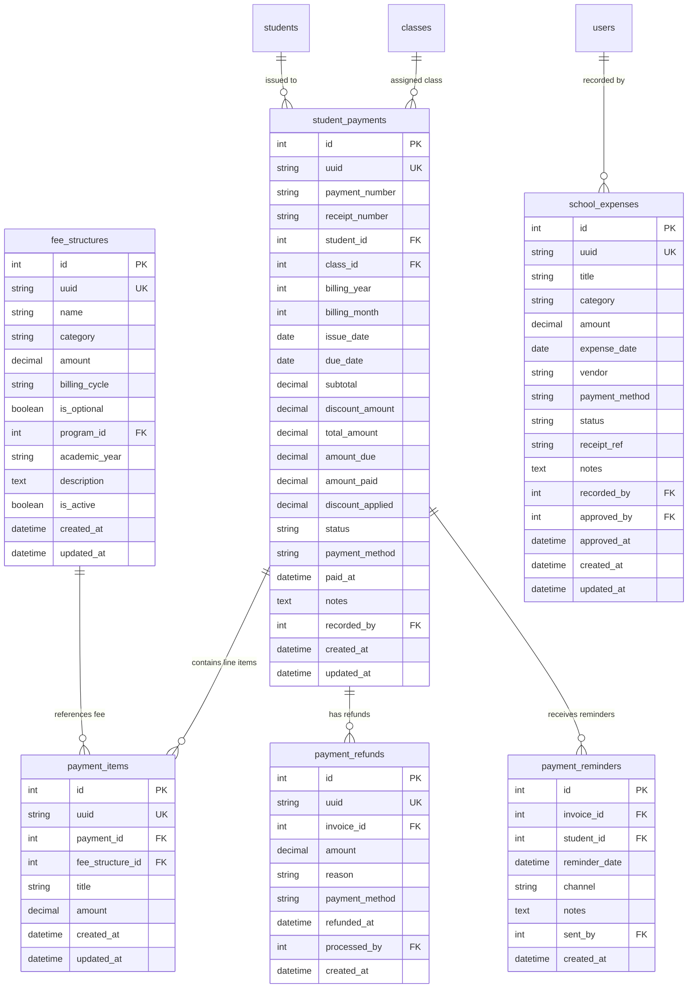

# Feature Spec: School Fee & Billing (under school operation)

## 1. Goal & Context
Build a comprehensive, production-ready **School Fee & Billing Management Subsystem** (under school operation) across shared contracts (`@repo/contracts`), backend API (`apps/api`), and frontend admin web (`apps/web`).

This subsystem manages the complete school financial lifecycle:
1. **Fee Structure Management**: Define tuition, registration, transportation, meals, activities, exam fees, and custom items. Each variant is saved as a distinct fee structure entry (e.g. "School Uniform - M" @ $5, "School Uniform - L" @ $6, "Book Fee" @ $10) for straightforward filtering, selection, and reporting.
2. **Unified Student Payments & Invoicing**: Auto-generate individual or batch student invoices/bills into the consolidated `student_payments` and `payment_items` architecture. In UI, admins can filter by Class/Program AND search student by name, then multi-select specific students (or 'Select All') to generate invoices. Invoices track line items, due dates, discounts, and status lifecycle (`UNPAID`, `PAID`, `OVERDUE`, `WAIVED`, `PARTIAL`).
3. **Payments, Receipts & Refunds**: Full receipt payments! Recording a payment issues a receipt with auto-generated receipt number format `REC-YYYYMM-XXXX` (e.g. `REC-202608-0001`, with manual edit override option), updating payment status to `PAID`. Supports full/partial payment refund logs.
4. **Official A5 School Receipt**: Standard A5 printable document (`148mm × 210mm`) featuring ELC Language Center branding, Khmer & English headings (**មជ្ឈមណ្ឌលសិក្សា អ៊ី អិល ស៊ី** / **English Learning Center**), itemized line items, bold red net subtotal, and standard student payment Terms & Conditions.
5. **Payment Reminders**: Maintain a log of payment reminders sent to students/parents for unpaid/overdue invoices.
6. **School Operational Expenses**: Two-step expense approval workflow! Log and categorize school spending (`SALARY`, `UTILITIES`, `MAINTENANCE`, `SUPPLIES`, `TRANSPORT`, `EVENTS`, `EQUIPMENT`, `OTHER`). Expenses start as `PENDING` and require an explicit manager approval step (`APPROVE` action) to transition to `APPROVED` / `PAID` or `REJECTED`.
7. **Financial Summary Analytics**: Real-time overview of total revenue collected (`SUM(amount_paid)`), outstanding/overdue receivables, approved operational expenses, net operating balance, and category breakdowns.

---

## 2. Requirements & Boundaries

### 2.1 Database Entities & ER Diagram

---

### 2.2 Schema Definitions

#### 1. `fee_structures` Table
| Column (`snake_case`) | Type | Nullable | Default | Description |
| :--- | :--- | :--- | :--- | :--- |
| `id` | `INT` | NO | AUTO_INCREMENT | Primary Key |
| `uuid` | `VARCHAR(36)` | NO | UUIDv4 | Unique UUID |
| `name` | `VARCHAR(255)` | NO | NULL | Fee name (e.g. "School Uniform - M", "Grade 10 Tuition Fee") |
| `category` | `ENUM` | NO | 'TUITION' | `TUITION`, `REGISTRATION`, `TRANSPORTATION`, `MEALS`, `ACTIVITIES`, `EXAM`, `OTHER` |
| `amount` | `DECIMAL(10,2)` | NO | 0.00 | Fee amount |
| `billing_cycle` | `ENUM` | NO | 'MONTHLY' | `ONE_TIME`, `MONTHLY`, `QUARTERLY`, `SEMESTER`, `ANNUAL` |
| `is_optional` | `BOOLEAN` | NO | false | Whether fee is optional or mandatory |
| `program_id` | `INT` | YES | NULL | Target program ID (optional) |
| `academic_year` | `VARCHAR(20)` | YES | NULL | Target academic year |
| `description` | `TEXT` | YES | NULL | Optional description |
| `is_active` | `BOOLEAN` | NO | true | Active status toggle |
| `created_at` | `TIMESTAMP` | NO | CURRENT_TIMESTAMP | Creation timestamp |
| `updated_at` | `TIMESTAMP` | NO | CURRENT_TIMESTAMP | Update timestamp |

#### 2. `student_payments` Table (Unified Billing & Invoices)
| Column (`snake_case`) | Type | Nullable | Default | Description |
| :--- | :--- | :--- | :--- | :--- |
| `id` | `INT` | NO | AUTO_INCREMENT | Primary Key |
| `uuid` | `VARCHAR(36)` | NO | UUIDv4 | Unique UUID |
| `payment_number` | `VARCHAR(100)` | YES | NULL | Unique invoice/billing reference (e.g. `INV-202608-0001`) |
| `receipt_number` | `VARCHAR(100)` | YES | NULL | Issued receipt number (e.g. `REC-202608-0001`) |
| `student_id` | `INT` | NO | NULL | Foreign key to `students.id` |
| `class_id` | `INT` | YES | NULL | Foreign key to `classes.id` |
| `billing_year` | `INT` | NO | 2026 | Billing year |
| `billing_month` | `INT` | NO | 8 | Billing month (1-12) |
| `issue_date` | `DATE` | YES | CURRENT_DATE | Invoice issue date |
| `due_date` | `DATE` | YES | NULL | Invoice payment due date |
| `subtotal` | `DECIMAL(10,2)` | NO | 0.00 | Total before discounts |
| `discount_amount` | `DECIMAL(10,2)` | NO | 0.00 | Applied discount amount |
| `total_amount` | `DECIMAL(10,2)` | NO | 0.00 | Final payable amount |
| `amount_due` | `DECIMAL(10,2)` | NO | 0.00 | Monthly gross amount due |
| `amount_paid` | `DECIMAL(10,2)` | NO | 0.00 | Total amount collected |
| `discount_applied`| `DECIMAL(10,2)` | NO | 0.00 | Student discount applied |
| `status` | `ENUM` | NO | 'UNPAID' | `PAID`, `UNPAID`, `OVERDUE`, `WAIVED`, `PARTIAL` |
| `payment_method` | `ENUM` | YES | 'CASH' | `CASH`, `KHQR`, `BANK_TRANSFER`, `CREDIT_CARD`, `OTHER` |
| `paid_at` | `TIMESTAMP` | YES | CURRENT_TIMESTAMP | Date and time payment was recorded |
| `notes` | `TEXT` | YES | NULL | Notes / terms |
| `recorded_by` | `INT` | YES | NULL | User ID who recorded transaction |
| `created_at` | `TIMESTAMP` | NO | CURRENT_TIMESTAMP | Creation timestamp |
| `updated_at` | `TIMESTAMP` | NO | CURRENT_TIMESTAMP | Update timestamp |

#### 3. `payment_items` Table
| Column (`snake_case`) | Type | Nullable | Default | Description |
| :--- | :--- | :--- | :--- | :--- |
| `id` | `INT` | NO | AUTO_INCREMENT | Primary Key |
| `uuid` | `VARCHAR(36)` | NO | UUIDv4 | Unique UUID |
| `payment_id` | `INT` | NO | NULL | Foreign key to `student_payments.id` |
| `fee_structure_id` | `INT` | YES | NULL | Foreign key to `fee_structures.id` |
| `title` | `VARCHAR(255)` | NO | NULL | Line item description |
| `amount` | `DECIMAL(10,2)` | NO | 0.00 | Line item cost |
| `created_at` | `TIMESTAMP` | NO | CURRENT_TIMESTAMP | Creation timestamp |
| `updated_at` | `TIMESTAMP` | NO | CURRENT_TIMESTAMP | Update timestamp |

#### 4. `payment_refunds` Table
| Column (`snake_case`) | Type | Nullable | Default | Description |
| :--- | :--- | :--- | :--- | :--- |
| `id` | `INT` | NO | AUTO_INCREMENT | Primary Key |
| `uuid` | `VARCHAR(36)` | NO | UUIDv4 | Unique UUID |
| `invoice_id` | `INT` | NO | NULL | Foreign key to `student_payments.id` |
| `amount` | `DECIMAL(10,2)` | NO | 0.00 | Refunded amount |
| `reason` | `TEXT` | NO | NULL | Reason for refund |
| `payment_method` | `ENUM` | NO | 'CASH' | `CASH`, `KHQR`, `BANK_TRANSFER`, `CREDIT_CARD`, `OTHER` |
| `refunded_at` | `TIMESTAMP` | NO | CURRENT_TIMESTAMP | Refund execution timestamp |
| `processed_by` | `INT` | YES | NULL | Foreign key to `users.id` |
| `created_at` | `TIMESTAMP` | NO | CURRENT_TIMESTAMP | Creation timestamp |

#### 5. `payment_reminders` Table
| Column (`snake_case`) | Type | Nullable | Default | Description |
| :--- | :--- | :--- | :--- | :--- |
| `id` | `INT` | NO | AUTO_INCREMENT | Primary Key |
| `invoice_id` | `INT` | NO | NULL | Foreign key to `student_payments.id` |
| `student_id` | `INT` | NO | NULL | Foreign key to `students.id` |
| `reminder_date` | `TIMESTAMP` | NO | CURRENT_TIMESTAMP | Date reminder was issued |
| `channel` | `VARCHAR(50)` | NO | 'IN_APP' | Channel: `IN_APP`, `SMS`, `EMAIL` |
| `notes` | `TEXT` | YES | NULL | Reminder notes |
| `sent_by` | `INT` | YES | NULL | User ID who sent reminder |
| `created_at` | `TIMESTAMP` | NO | CURRENT_TIMESTAMP | Creation timestamp |

#### 6. `school_expenses` Table
| Column (`snake_case`) | Type | Nullable | Default | Description |
| :--- | :--- | :--- | :--- | :--- |
| `id` | `INT` | NO | AUTO_INCREMENT | Primary Key |
| `uuid` | `VARCHAR(36)` | NO | UUIDv4 | Unique UUID |
| `title` | `VARCHAR(255)` | NO | NULL | Expense title |
| `category` | `ENUM` | NO | 'OTHER' | `SALARY`, `UTILITIES`, `MAINTENANCE`, `SUPPLIES`, `TRANSPORT`, `EVENTS`, `EQUIPMENT`, `OTHER` |
| `amount` | `DECIMAL(10,2)` | NO | 0.00 | Expense amount |
| `expense_date` | `DATE` | NO | CURRENT_DATE | Expense incur date |
| `vendor` | `VARCHAR(255)` | YES | NULL | Vendor / payee |
| `payment_method` | `ENUM` | NO | 'CASH' | `CASH`, `KHQR`, `BANK_TRANSFER`, `CREDIT_CARD`, `OTHER` |
| `status` | `ENUM` | NO | 'PENDING' | `PENDING`, `APPROVED`, `PAID`, `REJECTED` |
| `receipt_ref` | `VARCHAR(100)` | YES | NULL | Reference / receipt ID |
| `notes` | `TEXT` | YES | NULL | Notes / remarks |
| `recorded_by` | `INT` | YES | NULL | Foreign key to `users.id` |
| `approved_by` | `INT` | YES | NULL | Foreign key to `users.id` |
| `approved_at` | `TIMESTAMP` | YES | NULL | Timestamp when approved |
| `created_at` | `TIMESTAMP` | NO | CURRENT_TIMESTAMP | Creation timestamp |
| `updated_at` | `TIMESTAMP` | NO | CURRENT_TIMESTAMP | Update timestamp |

---

## 3. Tech Design & File Scope

### 3.1 Monorepo Shared Package (`@repo/contracts`)
- `packages/contracts/src/fee-structure.dto.ts`
- `packages/contracts/src/invoice.dto.ts`
- `packages/contracts/src/expense.dto.ts`
- `packages/contracts/src/payment-status.enum.ts`
- `packages/contracts/src/index.ts`

### 3.2 Backend API (`apps/api`)
- Database Migrations & Seeders:
  - `apps/api/database/migrations/2026.08.17T00.00.04.create-student_payments-table.ts`
  - `apps/api/database/migrations/2026.08.19T00.00.01.create-fee_structures-table.ts`
  - `apps/api/database/migrations/2026.08.19T00.00.03.create-payment_items-table.ts`
  - `apps/api/database/migrations/2026.08.19T00.00.04.create-payment_refunds-table.ts`
  - `apps/api/database/migrations/2026.08.19T00.00.05.create-payment_reminders-table.ts`
  - `apps/api/database/migrations/2026.08.19T00.00.06.create-school_expenses-table.ts`
  - `apps/api/database/seeds/2026.08.19T00.00.01.fee-billing-seeder.ts`
- Feature Module `src/fee`:
  - `apps/api/src/fee/entity/fee-structure.entity.ts`
  - `apps/api/src/fee/entity/payment-refund.entity.ts`
  - `apps/api/src/fee/entity/payment-reminder.entity.ts`
  - `apps/api/src/fee/entity/school-expense.entity.ts`
  - `apps/api/src/student/entity/student-payment.entity.ts`
  - `apps/api/src/student/entity/payment-item.entity.ts`
  - `apps/api/src/fee/mapper/fee-structure.mapper.ts`
  - `apps/api/src/fee/mapper/invoice.mapper.ts`
  - `apps/api/src/fee/mapper/expense.mapper.ts`
  - `apps/api/src/fee/fee-structure.controller.ts` & `service.ts`
  - `apps/api/src/fee/invoice.controller.ts` & `service.ts`
  - `apps/api/src/fee/expense.controller.ts` & `service.ts`
  - `apps/api/src/fee/fee-summary.controller.ts` & `service.ts`
  - `apps/api/src/fee/fee.module.ts`
- Unit & E2E Tests:
  - `apps/api/src/fee/fee-structure.service.spec.ts`
  - `apps/api/src/fee/expense.service.spec.ts`
  - `apps/api/test/fee-billing.e2e-spec.ts` (All 6 Condition Categories)

### 3.3 Frontend Web App (`apps/web`)
- Feature Module `src/features/fee-management`:
  - `apps/web/src/features/fee-management/hooks/use-fee-structures.ts`
  - `apps/web/src/features/fee-management/hooks/use-invoices.ts`
  - `apps/web/src/features/fee-management/hooks/use-expenses.ts`
  - `apps/web/src/features/fee-management/hooks/use-fee-summary.ts`
  - `apps/web/src/features/fee-management/components/fee-structure-list-table.tsx`
  - `apps/web/src/features/fee-management/components/fee-structure-dialog.tsx`
  - `apps/web/src/features/fee-management/components/invoice-list-table.tsx`
  - `apps/web/src/features/fee-management/components/generate-invoice-dialog.tsx`
  - `apps/web/src/features/fee-management/components/pay-invoice-dialog.tsx`
  - `apps/web/src/features/fee-management/components/refund-dialog.tsx`
  - `apps/web/src/features/fee-management/components/invoice-detail-dialog.tsx`
  - `apps/web/src/features/fee-management/components/payment-reminder-dialog.tsx`
  - `apps/web/src/features/fee-management/components/expense-list-table.tsx`
  - `apps/web/src/features/fee-management/components/expense-dialog.tsx`
  - `apps/web/src/features/fee-management/components/fee-billing-dashboard.tsx`
  - `apps/web/src/features/fee-management/components/school-receipt.tsx` (Official A5 Printable Template)
  - `apps/web/src/features/fee-management/components/school-receipt-modal.tsx`
- Student Feature Integration:
  - `apps/web/src/features/students/components/record-payment-dialog.tsx` (Instant A5 print)
  - `apps/web/src/features/students/components/student-payment-tracker.tsx` (Print A5 history action)
- Route Views & Shell Integration:
  - `apps/web/src/routes/fee-structures-page.tsx`
  - `apps/web/src/routes/invoices-page.tsx`
  - `apps/web/src/routes/expenses-page.tsx`
  - `apps/web/src/routes/router.tsx`
  - `apps/web/src/features/admin/components/admin-sidebar.tsx`

---

## 4. Acceptance Criteria
- [x] Unit tests pass via `pnpm test` (16/16 test files passed, 111/111 unit tests passed)
- [x] E2e tests pass via `pnpm test:e2e` (All 6 condition categories verified)
- [x] Frontend build & type check passes via `pnpm --filter web build` (Zero compilation errors)
- [x] Student payment unification: `student_payments` and `payment_items` consolidated
- [x] Official A5 School Receipt template implemented with ELC branding, clean preview and print formatting
