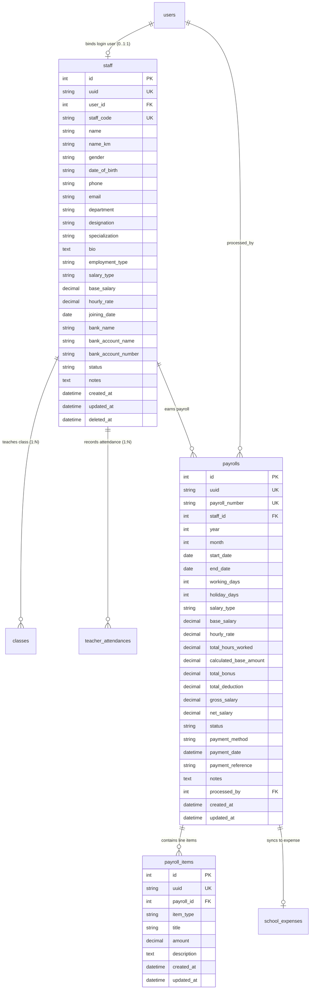

# Feature Spec: HR & Payroll Management Subsystem

## 1. Goal & Context
Build a comprehensive, production-grade **HR & Payroll Management Subsystem** across shared contracts (`@repo/contracts`), backend API (`apps/api`), and frontend admin web (`apps/web`).

This subsystem manages the complete employee lifecycle and staff compensation operations for educational institutions:
1. **Unified Staff & Teacher Management (Merged Single Source of Truth)**: Manage all institution personnel in a unified `staff` table across diverse departments (Academic/Teachers, Administration, Finance, Operations, Management, IT, Support). Support contact details, Khmer names, department classification, designations/specializations, employment types, bank payout details, and user account binding.
2. **Flexible Dual Salary Calculation Engine with Smart Cambodia Holiday Detection**:
   - **Model 1: Hourly Salary** (Calculated based on recorded teaching/working hours: `totalHoursWorked × hourlyRate`). Auto-calculates default hours from recorded attendance on valid non-holiday working days with manual admin override in the form.
   - **Model 2: Monthly Fixed Base Salary** (Standard contracted monthly salary rate with working days / holiday calculation).
3. **Itemized Dynamic Adjustments (Bonuses & Deductions)**: Multi-line item list per payroll (`payroll_items`) with categories (`BONUS`, `ALLOWANCE`, `OVERTIME`, `DEDUCTION`, `TAX`, `ADVANCE_SALARY`, `OTHER`), custom titles, and individual amounts.
4. **Individual Payroll Processing & Disbursal Lifecycle**:
   $$\text{DRAFT} \xrightarrow[\text{Disburse Payment}]{\text{mark PAID}} \text{PAID}$$
   $$\text{DRAFT} \xrightarrow[\text{Void / Discard}]{\text{mark CANCELLED}} \text{CANCELLED}$$
   Recording payment methods (Cash, Bank Transfer, ABA Pay, Wing, Cheque) and transaction references.
5. **Automatic School Operational Expense Sync**: Whenever a payroll is marked as `PAID`, the system automatically logs a corresponding `school_expenses` record (`category: 'SALARY'`, `status: 'PAID'`, `vendor: staffName`, `amount: netSalary`, `receiptRef: payrollNumber`).
6. **Printable Official A5 Payslip**: Standardized A5 printable document layout (`148mm × 210mm`) with bilingual (Khmer/English) ELC branding, working days / holiday count, itemized earnings/deductions breakdown, in-browser print trigger, and direct PDF download.

---

## 2. Requirements & Domain Modeling

### 2.1 Unified Staff Table Architecture (Merging Staff & Teachers)

---

### 2.2 Database Schema Definitions

#### 1. `staff` Table (Unified Staff & Teacher Entity)
| Column (`snake_case`) | Type | Nullable | Default | Description |
| :--- | :--- | :--- | :--- | :--- |
| `id` | `INT` | NO | AUTO_INCREMENT | Primary Key |
| `uuid` | `VARCHAR(36)` | NO | UUIDv4 | Unique UUID |
| `user_id` | `INT` | YES | NULL | Foreign Key $\rightarrow$ `users(id)` (ON DELETE SET NULL) |
| `staff_code` | `VARCHAR(50)` | YES | NULL | Unique code (e.g. `STF-2026-001`, `TCH-001`) |
| `name` | `VARCHAR(255)` | NO | NULL | Full English display name |
| `name_km` | `VARCHAR(255)` | YES | NULL | Khmer display name |
| `gender` | `VARCHAR(16)` | NO | 'MALE' | `MALE`, `FEMALE`, `OTHER` |
| `date_of_birth` | `VARCHAR(255)` | YES | NULL | Date of birth |
| `phone` | `VARCHAR(255)` | YES | NULL | Primary contact phone |
| `email` | `VARCHAR(255)` | YES | NULL | Email address |
| `department` | `VARCHAR(50)` | NO | 'ACADEMIC' | `ACADEMIC`, `ADMINISTRATION`, `FINANCE`, `OPERATIONS`, `MANAGEMENT`, `IT`, `LOGISTICS`, `OTHER` |
| `designation` | `VARCHAR(100)` | NO | 'Teacher' | Role title (e.g. "Teacher", "Academic Coordinator", "Branch Manager", "Accountant", "Driver") |
| `specialization` | `VARCHAR(255)` | YES | NULL | Academic subject specialization (for teachers) |
| `bio` | `TEXT` | YES | NULL | Biography / professional profile |
| `employment_type`| `VARCHAR(50)` | NO | 'FULL_TIME' | `FULL_TIME`, `PART_TIME`, `CONTRACT`, `INTERN` |
| `salary_type` | `VARCHAR(20)` | NO | 'MONTHLY' | `MONTHLY`, `HOURLY` |
| `base_salary` | `DECIMAL(10,2)` | NO | 0.00 | Monthly base salary (when `salary_type = 'MONTHLY'`) |
| `hourly_rate` | `DECIMAL(8,2)` | NO | 0.00 | Hourly rate (when `salary_type = 'HOURLY'`, e.g., teaching rate) |
| `joining_date` | `DATE` | YES | CURRENT_DATE | Date employee joined |
| `bank_name` | `VARCHAR(100)` | YES | NULL | Bank institution name (e.g. ABA Bank, ACLEDA, Canadia) |
| `bank_account_name` | `VARCHAR(255)` | YES | NULL | Bank account holder name |
| `bank_account_number` | `VARCHAR(100)` | YES | NULL | Bank account number / IBAN |
| `status` | `VARCHAR(26)` | NO | 'ACTIVE' | `ACTIVE`, `INACTIVE`, `ON_LEAVE`, `TERMINATED`, `ARCHIVED` |
| `notes` | `TEXT` | YES | NULL | General remarks / emergency info |
| `created_at` | `TIMESTAMP` | NO | CURRENT_TIMESTAMP | Creation timestamp |
| `updated_at` | `TIMESTAMP` | NO | CURRENT_TIMESTAMP | Update timestamp |
| `deleted_at` | `TIMESTAMP` | YES | NULL | Soft-delete timestamp |

---

#### 2. `payrolls` Table
| Column (`snake_case`) | Type | Nullable | Default | Description |
| :--- | :--- | :--- | :--- | :--- |
| `id` | `INT` | NO | AUTO_INCREMENT | Primary Key |
| `uuid` | `VARCHAR(36)` | NO | UUIDv4 | Unique UUID |
| `payroll_number` | `VARCHAR(100)` | NO | (Auto) | Unique voucher number (e.g. `PAY-202608-0001`) |
| `staff_id` | `INT` | NO | NULL | Foreign Key $\rightarrow$ `staff(id)` (ON DELETE CASCADE) |
| `year` | `INT` | NO | 2026 | Pay period year |
| `month` | `INT` | NO | 8 | Pay period month (1-12) |
| `start_date` | `DATE` | NO | NULL | Period cycle start date (e.g. `2026-08-01`) |
| `end_date` | `DATE` | NO | NULL | Period cycle end date (e.g. `2026-08-31`) |
| `working_days` | `INT` | NO | 22 | Total working days in month (excluding holidays & Sundays) |
| `holiday_days` | `INT` | NO | 0 | Total Cambodia public holidays in pay period |
| `salary_type` | `VARCHAR(20)` | NO | 'MONTHLY' | `MONTHLY`, `HOURLY` |
| `base_salary` | `DECIMAL(10,2)` | NO | 0.00 | Snapshot base salary |
| `hourly_rate` | `DECIMAL(8,2)` | NO | 0.00 | Snapshot hourly rate |
| `total_hours_worked` | `DECIMAL(8,2)` | NO | 0.00 | Total recorded hours worked in pay period |
| `calculated_base_amount` | `DECIMAL(10,2)` | NO | 0.00 | `base_salary` OR `total_hours_worked * hourly_rate` |
| `total_bonus` | `DECIMAL(10,2)` | NO | 0.00 | Sum of all bonus & allowance line items |
| `total_deduction` | `DECIMAL(10,2)` | NO | 0.00 | Sum of all deduction & tax line items |
| `gross_salary` | `DECIMAL(10,2)` | NO | 0.00 | `calculated_base_amount + total_bonus` |
| `net_salary` | `DECIMAL(10,2)` | NO | 0.00 | `gross_salary - total_deduction` |
| `status` | `VARCHAR(30)` | NO | 'DRAFT' | `DRAFT`, `PAID`, `CANCELLED` |
| `payment_method` | `VARCHAR(50)` | YES | 'BANK_TRANSFER' | `CASH`, `BANK_TRANSFER`, `CHEQUE`, `ABA_PAY`, `WING`, `OTHER` |
| `payment_date` | `TIMESTAMP` | YES | NULL | Timestamp when marked paid |
| `payment_reference` | `VARCHAR(100)` | YES | NULL | Cheque/bank transaction reference |
| `notes` | `TEXT` | YES | NULL | Payslip remarks / note for employee |
| `processed_by` | `INT` | YES | NULL | Foreign Key $\rightarrow$ `users(id)` |
| `created_at` | `TIMESTAMP` | NO | CURRENT_TIMESTAMP | Creation timestamp |
| `updated_at` | `TIMESTAMP` | NO | CURRENT_TIMESTAMP | Update timestamp |

---

#### 3. `payroll_items` Table
| Column (`snake_case`) | Type | Nullable | Default | Description |
| :--- | :--- | :--- | :--- | :--- |
| `id` | `INT` | NO | AUTO_INCREMENT | Primary Key |
| `uuid` | `VARCHAR(36)` | NO | UUIDv4 | Unique UUID |
| `payroll_id` | `INT` | NO | NULL | Foreign Key $\rightarrow$ `payrolls(id)` (ON DELETE CASCADE) |
| `item_type` | `VARCHAR(30)` | NO | 'BONUS' | `BONUS`, `ALLOWANCE`, `OVERTIME`, `DEDUCTION`, `TAX`, `ADVANCE_SALARY`, `OTHER` |
| `title` | `VARCHAR(255)` | NO | NULL | Line item description (e.g., "Monthly Bonus", "Overtime 5h", "Tax") |
| `amount` | `DECIMAL(10,2)` | NO | 0.00 | Positive monetary value |
| `description` | `TEXT` | YES | NULL | Detailed notes |
| `created_at` | `TIMESTAMP` | NO | CURRENT_TIMESTAMP | Creation timestamp |
| `updated_at` | `TIMESTAMP` | NO | CURRENT_TIMESTAMP | Update timestamp |

---

### 2.3 Salary Computation Engine & Cambodia Holiday Detection

#### 1. Cambodia Public Holidays Reference (`PUBLIC_HOLIDAYS`)
The system integrates Cambodia official public holidays (as defined in `apps/web/src/shared/data/public-holiday.ts` & shared backend holiday helper):
- Month 1: Jan 1 (New Year's Day), Jan 7 (Victory Day)
- Month 3: Mar 8 (International Women's Day)
- Month 4: Apr 14, 15, 16 (Khmer New Year)
- Month 5: May 1 (Labour Day), May 5 (Royal Ploughing Ceremony), May 14 (King Sihamoni's Birthday)
- Month 6: Jun 18 (Queen Mother's Birthday)
- Month 9: Sep 10, 11, 12 (Pchum Ben), Sep 24 (Constitution Day)
- Month 10: Oct 15 (King Father Commemoration), Oct 29 (King Sihamoni's Coronation Day)
- Month 11: Nov 9 (Independence Day), Nov 23, 24, 25 (Bon Om Touk / Water Festival)
- Month 12: Dec 29 (Peace Day)

#### 2. Working Days Calculation
For any given year & month (e.g. August 2026):
$$\text{Total Days} = \text{daysInMonth}(year, month)$$
$$\text{Holiday Days} = \text{countPublicHolidays}(year, month)$$
$$\text{Working Days} = \text{Total Days} - \text{SundayCount} - \text{HolidayDaysNotInSunday}$$

#### 3. Salary Computation Formulas
$$\text{Calculated Base Amount} = 
\begin{cases} 
\text{totalHoursWorked} \times \text{hourlyRate} & \text{if } \text{salaryType} = \text{HOURLY} \\
\text{baseSalary} & \text{if } \text{salaryType} = \text{MONTHLY} 
\end{cases}$$

$$\text{Total Bonus} = \sum \text{item.amount} \quad (\text{where itemType } \in \{\text{BONUS}, \text{ALLOWANCE}, \text{OVERTIME}\})$$

$$\text{Total Deduction} = \sum \text{item.amount} \quad (\text{where itemType } \in \{\text{DEDUCTION}, \text{TAX}, \text{ADVANCE\_SALARY}\})$$

$$\text{Gross Salary} = \text{Calculated Base Amount} + \text{Total Bonus}$$

$$\text{Net Salary} = \text{Gross Salary} - \text{Total Deduction}$$

---

### 2.4 Simplified Status Lifecycle & Operational Expense Sync

$$\text{DRAFT} \xrightarrow[\text{Disburse Payment}]{\text{mark PAID}} \text{PAID}$$
$$\text{DRAFT} \xrightarrow[\text{Void}]{\text{mark CANCELLED}} \text{CANCELLED}$$

- **`DRAFT`**: Draft payroll generated for an individual staff member, hours computed from attendance on valid working days, manual bonuses/deductions can be added/edited.
- **`PAID`**: Payment recorded with Payment Method (Cash, Bank Transfer, ABA Pay, Wing, Cheque), Payment Date, and Transaction Reference. **Always automatically logs an expense in `school_expenses` (`category: SALARY`, `status: PAID`, `vendor: staffName`, `amount: netSalary`, `receiptRef: payrollNumber`)**.
- **`CANCELLED`**: Cancelled/voided record.

---

### 2.5 Official Printable A5 Payslip Layout (`148mm × 210mm`)
- Standardized institutional header: ELC Language Center branding, Khmer & English titles (**មជ្ឈមណ្ឌលសិក្សា អ៊ី អិល ស៊ី** / **English Learning Center**).
- Payslip metadata: Pay Period (e.g., August 2026), Voucher Number (`PAY-202608-0001`), Working Days (22 Days), Cambodia Holidays (0 Days), Issue Date, Payment Method.
- Staff details: Staff Code, Full Name, Khmer Name, Designation, Department, Bank Name & Account Number.
- Dual-table earnings & deductions breakdown:
  - **Earnings**: Base Salary / Hourly Rate $\times$ Hours Worked, Bonuses, Allowances, Overtime.
  - **Deductions**: Taxes, Unpaid Leaves, Advances.
  - **Net Payable Salary**: Bold highlighted total in USD.
- Signatures: Prepared By (HR / Admin), Staff Acknowledgment Signature.
- Presentation: In-browser modal preview, window print button, and direct PDF download in A5 dimensions.

---

## 3. Tech Design & Monorepo Scope

### 3.1 `@repo/contracts`
- `packages/contracts/src/staff.dto.ts` — Enums (`StaffDepartmentEnum`, `StaffEmploymentTypeEnum`, `StaffSalaryTypeEnum`, `StaffStatusEnum`), `StaffSchema`, `CreateStaffSchema`, `UpdateStaffSchema`, `FindStaffSchema`.
- `packages/contracts/src/payroll.dto.ts` — Enums (`PayrollStatusEnum` with `DRAFT`, `PAID`, `CANCELLED`, `PayrollItemTypeEnum`), `PayrollItemSchema`, `CreatePayrollItemSchema`, `PayrollSchema`, `CreatePayrollSchema`, `UpdatePayrollSchema`, `FindPayrollsSchema`, `ProcessPayrollPaymentSchema`, `PayrollSummarySchema`.
- `packages/contracts/src/route.ts` — `API_ROUTE.HR` route paths.
- `packages/contracts/src/index.ts` — Export all new DTOs and types.

### 3.2 Backend API (`apps/api`)
- Database Migrations & Seeds:
  - `apps/api/database/migrations/2026.08.20T00.00.01.create-staff-table.ts`
  - `apps/api/database/migrations/2026.08.20T00.00.02.create-payrolls-and-items-tables.ts`
  - `apps/api/database/seeds/2026.08.20T00.00.01.hr-payroll-seeder.ts`
- Feature Module `src/hr`:
  - `apps/api/src/hr/entity/staff.entity.ts`
  - `apps/api/src/hr/entity/payroll.entity.ts`
  - `apps/api/src/hr/entity/payroll-item.entity.ts`
  - `apps/api/src/hr/dto/staff.dto.ts` & `apps/api/src/hr/dto/payroll.dto.ts`
  - `apps/api/src/hr/mapper/staff.mapper.ts` & `payroll.mapper.ts`
  - `apps/api/src/hr/staff.service.ts` & `admin.staff.controller.ts`
  - `apps/api/src/hr/payroll.service.ts` & `admin.payroll.controller.ts`
  - `apps/api/src/hr/hr.permission.ts` & `hr.hook.ts`
  - `apps/api/src/hr/hr.module.ts`
- Tests:
  - `apps/api/src/hr/staff.service.spec.ts`
  - `apps/api/src/hr/payroll.service.spec.ts`
  - `apps/api/test/hr-payroll.e2e-spec.ts` (Covering All 6 Condition Categories)

### 3.3 Frontend Web App (`apps/web`)
- Feature Module `src/features/hr-payroll`:
  - `apps/web/src/features/hr-payroll/hooks/use-staff-query.ts`
  - `apps/web/src/features/hr-payroll/hooks/use-payroll-query.ts`
  - `apps/web/src/features/hr-payroll/components/staff-list-table.tsx`
  - `apps/web/src/features/hr-payroll/components/staff-form-dialog.tsx`
  - `apps/web/src/features/hr-payroll/components/staff-detail-dialog.tsx`
  - `apps/web/src/features/hr-payroll/components/payroll-list-table.tsx`
  - `apps/web/src/features/hr-payroll/components/payroll-form-dialog.tsx`
  - `apps/web/src/features/hr-payroll/components/payroll-payment-dialog.tsx`
  - `apps/web/src/features/hr-payroll/components/payslip-modal.tsx` (Printable A5 Template & PDF Download)
  - `apps/web/src/features/hr-payroll/components/payroll-summary-cards.tsx`
- Route Pages:
  - `apps/web/src/routes/staff-directory-page.tsx` (`/hr-payroll/directory`)
  - `apps/web/src/routes/payroll-salary-page.tsx` (`/hr-payroll/salary`)
  - `apps/web/src/routes/router.tsx` & `admin-sidebar.tsx`

---

## 4. Testing & Verification Summary

### 4.1 All 6 Condition Categories Verification
1. **Happy Path (200 / 201)**:
   - Create staff with monthly/hourly salary & user account binding.
   - Query staff directory with pagination, search, department, and salary type filters.
   - Create draft payroll for staff with automated Cambodia holiday detection & working day count.
   - Add dynamic adjustment line items (Bonuses, Overtime, Allowances, Deductions, Tax, Advances).
   - Update draft payroll amounts, total hours worked, and line items.
   - Disburse payment (`POST /pay`) to transition `DRAFT -> PAID`, recording method & transaction reference.
   - Syncs automatically to `school_expenses` (`category = 'SALARY'`, `status = 'PAID'`).
   - Fetch payroll financial summary and render printable A5 payslip with PDF download.
2. **Validation Failures (400 Bad Request)**:
   - Missing required staff name, invalid email, or invalid salary type rejected by `ZodValidationPipe`.
   - Missing payroll month (>12) or negative base salary / hourly rate rejected.
   - Invalid payment method rejected.
3. **Duplicate & Uniqueness Conflicts (409 Conflict)**:
   - Duplicate staff code rejected.
   - Duplicate payroll voucher for the same staff member in the same year/month rejected.
   - Attempting to pay an already PAID payroll rejected.
   - Attempting to update a PAID payroll record rejected.
4. **Resource Not Found (404 Not Found)**:
   - Querying or updating non-existent staff ID or payroll ID returns 404 with standard envelope.
5. **Authentication & Authorization (401 / 403)**:
   - Unauthenticated requests blocked by `JwtAuthGuard`.
   - Non-admin / non-HR users blocked by CASL `HrPermissionGuard`.
6. **Edge & Boundary Limits**:
   - 0 hours worked on hourly teacher yields 0.00 base amount without division/calculation errors.
   - Negative net salary resulting from excessive deductions handled safely.
   - Teacher attendance batch daily roster auto-sum calculates logged hours with manual admin override support.

---

## 5. Acceptance Criteria
- [x] Shared schemas and DTOs built with `pnpm --filter @repo/contracts build`
- [x] Database migrations and seeders run cleanly:
  - `2026.08.20T00.00.01.create-staff-table.ts`
  - `2026.08.20T00.00.02.create-payrolls-and-items-tables.ts`
  - `2026.08.20T00.00.03.fix-teacher-attendance-foreign-keys.ts`
  - `2026.08.20T00.00.01.hr-payroll-seeder.ts`
- [x] Unit test suites pass via `pnpm test`:
  - `src/hr/staff.service.spec.ts` (Passed)
  - `src/hr/payroll.service.spec.ts` (Passed)
  - Web unit tests for `StaffListTable`, `PayrollListTable`, `PayslipModal`, `TeacherAttendanceTable` (Passed)
- [x] All 6 condition categories E2E tests pass via `pnpm --filter api exec vitest run test/hr-payroll.e2e-spec.ts` (22/22 passed)
- [x] Full API E2E suite passes (`pnpm --filter api test:e2e`: 11 test suites, 111 passed)
- [x] Zero oxlint errors via `pnpm lint`
- [x] Full monorepo build succeeds via `pnpm build` (`@repo/contracts`, `apps/api`, `apps/web`)
- [x] Cambodia holiday detection accurately computes monthly working days and holiday counts
- [x] Simplified `DRAFT -> PAID -> CANCELLED` status flow functioning smoothly with automated `school_expenses` sync
- [x] Official A5 printable payslip rendered accurately with bilingual ELC Language Center branding and direct PDF export
