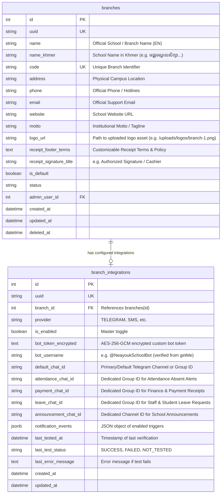
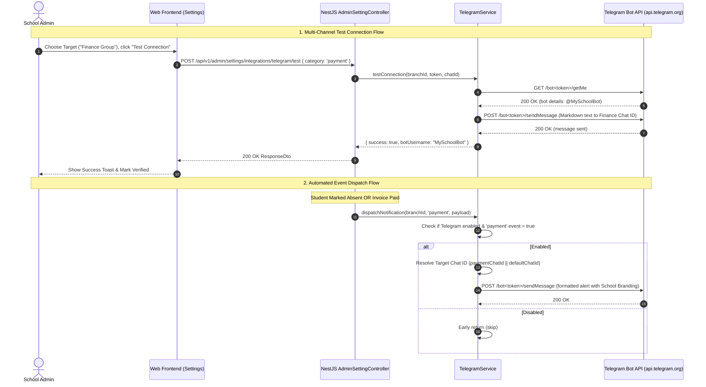

# Feature Spec: School Settings & Integrations (Profile, Branding Logo, Telegram Connect, Universal Document Binding)

## 1. Goal & Context
Build a production-ready **School Settings & Integrations Subsystem** across shared contracts (`@repo/contracts`), backend API (`apps/api`), and frontend admin web (`apps/web`).

### Key Business Goals:
1. **School Profile & Identity Management**:
   - Provide school administrators (`ADMIN` / `CMS` with `ResourceEnum.SETTING` permission) the ability to manage institutional identity: School Name (English & Khmer/local), Branch Name, Branch Code, Official Contact Numbers, Support Email, Physical Campus Address, Website, and School Motto/Tagline.
   - Centralize school identity data so that receipts, grade report cards, and student invoices dynamically display accurate branch-specific school information instead of hardcoded strings.
2. **School Branding & Dynamic Logo**:
   - Allow uploading, previewing, and updating the official School Logo (supporting PNG, SVG, JPG, WebP up to 2MB).
   - Real-time image preview with aspect ratio guides (1:1 square or horizontal transparent SVG).
   - Stored on local disk with SHA-hash filenames under `uploads/logos/` and served via NestJS static asset endpoint (`/uploads/logos/...`).
3. **Universal Branding Binding (Bill Receipts, Report Cards & Application Shell)**:
   - **Bill & Payment Receipts**: Dynamically bind the uploaded School Logo, School English Name, School Khmer Name, Motto, and Campus Contact Details to the printable A5 School Receipt (`SchoolReceipt`), eliminating hardcoded "ELC Language Center" / "English Learning Center" text and placeholder SVGs.
   - **Customizable Receipt Footer & Terms**: Allow schools to customize receipt disclaimer terms (e.g. refund/exchange policies) and cashier/authorized signature titles directly from School Settings.
   - **Student Progress Report Cards**: Bind the School Logo, School Name (English & Khmer), and Campus Address as the official institutional letterhead for printable student monthly and term report cards (`student-report-card-modal.tsx`).
   - **Back-Office UI Shell**: Dynamically bind the logo and school name to `AdminHeader` and `AdminSidebar`, falling back gracefully to `/neayouk_logo.svg` when no custom logo is uploaded.
   - **Automated Telegram Alerts**: Prefix all automated alert broadcasts (attendance, fee payments, leave requests) with the official school name and branch tag.
4. **School Integration: White-Label Telegram Bot Notification Engine**:
   - Each school brings their own custom **Telegram Bot** created via `@BotFather` (`@YourSchoolBot`), providing 100% white-label institutional branding in Telegram for students, parents, and staff.
   - **Multi-Channel Alert Routing**: Support dedicated Telegram Chat IDs per category (e.g., separate channels/groups for Attendance Alerts, Fee Receipts, and Leave Requests) with seamless fallback to a Master Default Chat ID.
   - Provide a real-time **"Test Connection"** mechanism (`POST /api/v1/admin/settings/integrations/telegram/test`) to verify bot token validity with Telegram (`getMe`) and send a styled test announcement to the configured chat.
   - Configure event-driven automated notifications with granular toggles:
     - 📢 Student Daily Attendance Alerts (Absent / Truancy alerts -> Attendance Chat ID)
     - 💳 Fee Payment & Receipt Confirmations (Instant invoice payment receipts -> Finance Chat ID)
     - 📝 Staff & Student Leave Requests (New submissions and approval status changes -> HR/Management Chat ID)
     - 📣 School Announcements & Event Broadcasts (General School Chat ID)
5. **Single-Branch Multi-Tenant Scoping & Security**:
   - In alignment with `branch-and-tenant-admin-scoping.md`, each branch has isolated settings, branding assets, and Telegram credentials (`branch_id` scoping).
   - Sensitive credentials such as Telegram Bot Tokens are encrypted at rest using AES-256-GCM and never returned in plaintext to the frontend (masked with `••••••••`).
   - Access is strictly gated via CASL (`ResourceEnum.SETTING`, actions `read`, `update`, `manage`) and `BranchHook`.

---

## 2. Requirements & Boundaries

### 2.1 Database Architecture & Schema Changes



#### Migration Details (`apps/api/database/migrations/`):
- [x] **Migration `2026.09.07T00.00.01.add-school-profile-and-logo-to-branches.ts`**:
  - Add columns to `branches`:
    - `name_khmer VARCHAR(255) NULL`
    - `website VARCHAR(255) NULL`
    - `motto VARCHAR(255) NULL`
    - `logo_url VARCHAR(500) NULL`
    - `receipt_footer_terms TEXT NULL`
    - `receipt_signature_title VARCHAR(100) NULL DEFAULT 'Authorized Signature / Cashier'`
- [x] **Migration `2026.09.07T00.00.02.create-branch-integrations-table.ts`**:
  - Create table `branch_integrations`:
    - `id SERIAL PRIMARY KEY`
    - `uuid VARCHAR(36) NOT NULL UNIQUE`
    - `branch_id INT NOT NULL REFERENCES branches(id) ON DELETE CASCADE`
    - `provider VARCHAR(50) NOT NULL DEFAULT 'TELEGRAM'`
    - `is_enabled BOOLEAN NOT NULL DEFAULT FALSE`
    - `bot_token_encrypted TEXT NULL`
    - `bot_username VARCHAR(100) NULL`
    - `default_chat_id VARCHAR(100) NULL`
    - `attendance_chat_id VARCHAR(100) NULL`
    - `payment_chat_id VARCHAR(100) NULL`
    - `leave_chat_id VARCHAR(100) NULL`
    - `announcement_chat_id VARCHAR(100) NULL`
    - `notification_events JSONB NOT NULL DEFAULT '{"attendance": true, "payment": true, "leave": true, "announcement": false}'::jsonb`
    - `last_tested_at TIMESTAMP NULL`
    - `last_test_status VARCHAR(50) NULL DEFAULT 'NOT_TESTED'`
    - `last_error_message TEXT NULL`
    - `created_at TIMESTAMP NOT NULL DEFAULT CURRENT_TIMESTAMP`
    - `updated_at TIMESTAMP NOT NULL DEFAULT CURRENT_TIMESTAMP`
    - Unique constraint on `(branch_id, provider)`

---

### 2.2 Shared Contracts (`packages/contracts`)

- [ ] **Resource Confirmation**:
  - Verify `ResourceEnum.SETTING = "setting"` in `resource.enum.ts` and `permission-tree.ts` (actions: `read`, `update`, `manage`).
- [ ] **School Setting DTOs & Validation Schemas (`packages/contracts/src/school-setting.dto.ts`)**:
  - `UpdateSchoolProfileSchema`:
    ```ts
    export const UpdateSchoolProfileSchema = z.object({
      name: z.string().min(1, 'School/Branch name is required').max(255),
      nameKhmer: z.string().max(255).optional().or(z.literal('')),
      code: z.string().min(1).max(20).optional(),
      address: z.string().max(255).optional().or(z.literal('')),
      phone: z.string().max(50).optional().or(z.literal('')),
      email: z.string().email('Invalid email address').optional().or(z.literal('')),
      website: z.string().url('Invalid website URL').optional().or(z.literal('')),
      motto: z.string().max(255).optional().or(z.literal('')),
      receiptFooterTerms: z.string().max(1000).optional().or(z.literal('')),
      receiptSignatureTitle: z.string().max(100).optional().or(z.literal('')),
    });
    ```
  - `SchoolProfileSchema`:
    ```ts
    export const SchoolProfileSchema = z.object({
      id: z.number(),
      uuid: z.string().uuid(),
      name: z.string(),
      nameKhmer: z.string().nullable().optional(),
      code: z.string(),
      address: z.string().nullable().optional(),
      phone: z.string().nullable().optional(),
      email: z.string().nullable().optional(),
      website: z.string().nullable().optional(),
      motto: z.string().nullable().optional(),
      logoUrl: z.string().nullable().optional(),
      receiptFooterTerms: z.string().nullable().optional(),
      receiptSignatureTitle: z.string().nullable().optional(),
      isDefault: z.boolean(),
      status: z.nativeEnum(BranchStatusEnum),
      updatedAt: z.union([z.string(), z.date()]).optional(),
    });
    ```
  - `TelegramNotificationEventsSchema`:
    ```ts
    export const TelegramNotificationEventsSchema = z.object({
      attendance: z.boolean().default(true),
      payment: z.boolean().default(true),
      leave: z.boolean().default(true),
      announcement: z.boolean().default(false),
    });
    ```
  - `UpdateTelegramIntegrationSchema`:
    ```ts
    export const UpdateTelegramIntegrationSchema = z.object({
      isEnabled: z.boolean().default(false),
      botToken: z.string().optional().describe('Raw Telegram Bot token from @BotFather. If omitted or masked, existing token is preserved.'),
      defaultChatId: z.string().min(1, 'Default Chat ID is required'),
      attendanceChatId: z.string().optional().or(z.literal('')),
      paymentChatId: z.string().optional().or(z.literal('')),
      leaveChatId: z.string().optional().or(z.literal('')),
      announcementChatId: z.string().optional().or(z.literal('')),
      notificationEvents: TelegramNotificationEventsSchema.default({}),
    });
    ```
  - `TelegramIntegrationSchema`:
    ```ts
    export const TelegramIntegrationSchema = z.object({
      id: z.number().optional(),
      uuid: z.string().uuid().optional(),
      branchId: z.number(),
      provider: z.literal('TELEGRAM'),
      isEnabled: z.boolean(),
      isConfigured: z.boolean(),
      botUsername: z.string().nullable().optional(),
      botTokenMasked: z.string().nullable().optional(),
      defaultChatId: z.string().nullable().optional(),
      attendanceChatId: z.string().nullable().optional(),
      paymentChatId: z.string().nullable().optional(),
      leaveChatId: z.string().nullable().optional(),
      announcementChatId: z.string().nullable().optional(),
      notificationEvents: TelegramNotificationEventsSchema,
      lastTestedAt: z.union([z.string(), z.date(), z.null()]).optional(),
      lastTestStatus: z.enum(['SUCCESS', 'FAILED', 'NOT_TESTED']).optional(),
      lastErrorMessage: z.string().nullable().optional(),
    });
    ```
  - `TestTelegramConnectionSchema`:
    ```ts
    export const TestTelegramConnectionSchema = z.object({
      targetCategory: z.enum(['default', 'attendance', 'payment', 'leave', 'announcement']).default('default'),
      chatId: z.string().optional(),
      customMessage: z.string().max(200).optional(),
    });
    ```
  - `TestTelegramResultSchema`:
    ```ts
    export const TestTelegramResultSchema = z.object({
      success: z.boolean(),
      message: z.string(),
      botUsername: z.string().optional(),
      chatId: z.string(),
      testedAt: z.string(),
    });
    ```
- [ ] **Route Constants (`packages/contracts/src/route.ts`)**:
  - Add `API_ROUTE.SETTING`:
    ```ts
    SETTING: {
      PROFILE: '/api/v1/admin/settings/profile',
      UPDATE_PROFILE: '/api/v1/admin/settings/profile',
      UPLOAD_LOGO: '/api/v1/admin/settings/logo',
      DELETE_LOGO: '/api/v1/admin/settings/logo',
      TELEGRAM: '/api/v1/admin/settings/integrations/telegram',
      UPDATE_TELEGRAM: '/api/v1/admin/settings/integrations/telegram',
      TEST_TELEGRAM: '/api/v1/admin/settings/integrations/telegram/test',
    }
    ```
- [ ] **Export & Build**: Export all schemas and inferred DTO types from `packages/contracts/src/index.ts`.

---

### 2.3 Backend API (`apps/api`)

- [ ] **Encryption Helper (`apps/api/src/common/helper/crypto.helper.ts`)**:
  - AES-256-GCM symmetric encryption and decryption for sensitive third-party tokens using an application secret key (`APP_SECRET` or `JWT_SECRET`).
  - Helper to mask bot tokens (e.g. `123456789:AA••••••••••••••••••••••••••••••••••`).
- [ ] **Entities (`apps/api/src/setting/entity/`)**:
  - `BranchIntegration` entity: TypeORM entity mapped to `branch_integrations` table with relation to `Branch`.
  - Update `Branch` entity (`apps/api/src/branch/entity/branch.entity.ts`) with `nameKhmer`, `website`, `motto`, `logoUrl`, `receiptFooterTerms`, `receiptSignatureTitle`, and one-to-one relation with `BranchIntegration`.
- [ ] **Telegram Service (`apps/api/src/setting/telegram.service.ts`)**:
  - Encapsulates Telegram Bot API via native Node `fetch`:
    - `getMe(botToken: string)`: Calls `https://api.telegram.org/bot<token>/getMe` to validate credentials and retrieve `username`.
    - `sendMessage(botToken: string, chatId: string, text: string, parseMode: 'HTML' | 'MarkdownV2')`: Sends formatted messages.
    - `resolveChatId(integration: BranchIntegration, category: 'attendance' | 'payment' | 'leave' | 'announcement'): string`: Checks category-specific chat ID, falling back to `default_chat_id`.
    - `sendTestMessage(botToken: string, chatId: string, schoolName: string, category: string)`: Sends a styled verification payload with timestamps, category badge, and branch tags.
    - `dispatchNotification(branchId: number, event: 'attendance' | 'payment' | 'leave' | 'announcement', message: string)`: Checks if branch integration is enabled and event trigger is turned on, resolves the targeted Chat ID, and dispatches the message asynchronously.
- [ ] **Setting Service (`apps/api/src/setting/setting.service.ts`)**:
  - `getSchoolProfile(currentUser: AuthContext)`: Resolves current branch and returns sanitized `SchoolProfileDto`.
  - `updateSchoolProfile(currentUser: AuthContext, dto: UpdateSchoolProfileDto)`: Updates branch details with conflict check on unique `code`.
  - `updateSchoolLogo(currentUser: AuthContext, file: Express.Multer.File)`: Validates file size (≤2MB) and MIME type (`image/png`, `image/jpeg`, `image/svg+xml`, `image/webp`). Saves file to static storage `public/uploads/logos/branch-<id>-<hash>.<ext>`, updates `branch.logoUrl`, and removes any obsolete previous logo file.
  - `deleteSchoolLogo(currentUser: AuthContext)`: Deletes custom logo file and sets `branch.logoUrl = null`.
  - `getTelegramIntegration(currentUser: AuthContext)`: Fetches integration row for current branch, returning masked token and connection health status.
  - `updateTelegramIntegration(currentUser: AuthContext, dto: UpdateTelegramIntegrationDto)`: Validates token with Telegram API if a new token was supplied, encrypts token, updates event flags and `botUsername`, and persists record.
  - `testTelegramConnection(currentUser: AuthContext, dto: TestTelegramConnectionDto)`: Performs live test message dispatch to targeted or default chat ID, records timestamp and status (`SUCCESS` or `FAILED`), and returns diagnostic message.
- [ ] **Setting Controller (`apps/api/src/setting/admin.setting.controller.ts`)**:
  - Mounts under `/api/v1/admin/settings`.
  - Gated by `@UseGuards(JwtAuthGuard, UserTypesGuard, CaslAccessGuard)`.
  - `@UserTypes(UserTypeEnum.ADMIN, UserTypeEnum.CMS, UserTypeEnum.SUPER_ADMIN)`.
  - Endpoints:
    - `GET /profile` -> `@UseAbility(DefaultActions.read, 'setting')`
    - `PATCH /profile` -> `@UseAbility(DefaultActions.update, 'setting')`
    - `POST /logo` -> `@UseInterceptors(FileInterceptor('logo'))` + `@UseAbility(DefaultActions.update, 'setting')`
    - `DELETE /logo` -> `@UseAbility(DefaultActions.update, 'setting')`
    - `GET /integrations/telegram` -> `@UseAbility(DefaultActions.read, 'setting')`
    - `PUT /integrations/telegram` -> `@UseAbility(DefaultActions.update, 'setting')`
    - `POST /integrations/telegram/test` -> `@UseAbility(DefaultActions.update, 'setting')`
- [ ] **Static Asset Serving in API (`apps/api/src/main.ts` or `app.module.ts`)**:
  - Configure NestJS Express static assets serving for `uploads/` directory mapped to `/uploads` URL path so uploaded logos are accessible by web browsers and printable reports.

---

### 2.4 Universal Branding Binding Matrix (Where Logo & School Name Bind)

To eliminate hardcoded placeholders across the entire application, the School Settings subsystem exposes a global React query hook `useSchoolProfileQuery()` (and lightweight branding context), dynamically injecting the active school's branding into the following touchpoints:

| Touchpoint | Target File / Component | Data Bound | Dynamic Behavior & Fallback |
| :--- | :--- | :--- | :--- |
| **1. Official A5 Bill Receipt** | [`apps/web/src/features/fee-management/components/school-receipt.tsx`](file:///e:/work/neayouk/apps/web/src/features/fee-management/components/school-receipt.tsx) | • School Logo (`logoUrl`)<br>• Khmer Name (`nameKhmer`)<br>• English Name (`name`)<br>• Motto (`motto`)<br>• Campus Phone & Address<br>• Custom Receipt Terms (`receiptFooterTerms`)<br>• Signature Title (`receiptSignatureTitle`) | Replaces hardcoded "ELC Language Center", "English Learning Center", static terms, and placeholder SVG. Falls back to a clean emblem if no custom logo is uploaded. |
| **2. Invoice & Receipt Modals** | [`apps/web/src/features/fee-management/components/school-receipt-modal.tsx`](file:///e:/work/neayouk/apps/web/src/features/fee-management/components/school-receipt-modal.tsx)<br>[`invoice-detail-dialog.tsx`](file:///e:/work/neayouk/apps/web/src/features/fee-management/components/invoice-detail-dialog.tsx)<br>[`record-payment-dialog.tsx`](file:///e:/work/neayouk/apps/web/src/features/students/components/record-payment-dialog.tsx) | Live `schoolProfile` passed into receipt preview & print engine | Ensures real-time consistency on screen and during A5 / thermal printing. |
| **3. Student Report Card** | [`apps/web/src/features/examinations/components/student-report-card-modal.tsx`](file:///e:/work/neayouk/apps/web/src/features/examinations/components/student-report-card-modal.tsx) | • Official Letterhead with Logo<br>• School Name (EN & Khmer)<br>• Campus Address & Phone | Replaces the plain gray header card with an official printable institutional letterhead. |
| **4. Back-Office Header** | [`apps/web/src/features/admin/components/admin-header.tsx`](file:///e:/work/neayouk/apps/web/src/features/admin/components/admin-header.tsx) | • Header Brand Logo<br>• School / Campus Name<br>• Branch Code badge | Dynamically reflects the branch identity instead of static `"Neayouk"` branding. Falls back to `/neayouk_logo.svg`. |
| **5. Back-Office Sidebar** | [`apps/web/src/features/admin/components/admin-sidebar.tsx`](file:///e:/work/neayouk/apps/web/src/features/admin/components/admin-sidebar.tsx) | • Compact & drawer brand logo | Displays branch branding icon in mobile and sidebar drawers. |
| **6. Telegram Broadcasts** | [`apps/api/src/setting/telegram.service.ts`](file:///e:/work/neayouk/apps/api/src/setting/telegram.service.ts) | • Header: `🏫 [School Name] - Official Alert`<br>• Sub-tag: `[Attendance / Finance / HR]`<br>• Footer: `— [Motto / Branch Code]` | Formatted neatly in MarkdownV2/HTML and delivered to dedicated channel. |
| **7. Browser Document Title** | [`apps/web/src/App.tsx`](file:///e:/work/neayouk/apps/web/src/App.tsx) or Layout | • Document title set to `${schoolName} | Neayouk CMS` | Dynamically updates browser tab title. |

#### Detailed Binding in `SchoolReceipt` (`school-receipt.tsx`):
```tsx
// Before: Hardcoded ELC Language Center & static SVG
// After: Dynamically bound from useSchoolProfileQuery or passed prop
<div className="flex items-center justify-between gap-4 mb-4">
  <div className="flex flex-col items-center flex-shrink-0 text-center">
    <span className="text-[10px] font-bold text-[#b91c1c] mb-1 font-serif tracking-tight">
      {schoolProfile?.name || "Institution Name"}
    </span>
    <div className="relative w-16 h-16 rounded-full border-2 border-[#1e40af] bg-sky-50/50 flex flex-col items-center justify-center p-1 shadow-xs overflow-hidden">
      {schoolProfile?.logoUrl ? (
        
      ) : (
        <DefaultSchoolLogoEmblem />
      )}
      {schoolProfile?.motto && (
        <div className="absolute -bottom-1 bg-[#1d4ed8] text-white text-[5.5px] font-bold px-1 py-0.5 rounded-full uppercase tracking-tighter shadow-xs whitespace-nowrap max-w-[58px] truncate">
          {schoolProfile.motto}
        </div>
      )}
    </div>
  </div>

  <div className="flex-1 text-center pr-2">
    {schoolProfile?.nameKhmer && (
      <h2
        className="text-lg sm:text-xl font-bold text-[#b91c1c] tracking-normal mb-0.5 leading-tight font-khmer"
        style={{ fontFamily: "'Khmer OS Muol Light', 'Siemreap', serif" }}
      >
        {schoolProfile.nameKhmer}
      </h2>
    )}
    <h3 className="text-base sm:text-lg font-bold text-[#b91c1c] font-serif tracking-tight">
      {schoolProfile?.name || "English Learning Center"}
    </h3>
    {schoolProfile?.address && (
      <p className="text-[9px] text-slate-600 font-sans tracking-tight">
        {schoolProfile.address} {schoolProfile.phone ? `• Tel: ${schoolProfile.phone}` : ''}
      </p>
    )}
  </div>
</div>

{/* Custom Footer Terms & Signature Title */}
<div className="mt-6 pt-2 border-t border-dashed border-slate-300 text-[9px] text-slate-600 font-sans">
  <p className="whitespace-pre-line leading-relaxed">
    {schoolProfile?.receiptFooterTerms || "1. Payments are non-refundable after class commencement.\n2. Please retain this official receipt for verification."}
  </p>
  <div className="flex justify-between items-center mt-6 pt-2">
    <div className="text-center w-36 border-t border-slate-400 pt-1">
      <span className="font-semibold text-slate-800">Student / Guardian</span>
    </div>
    <div className="text-center w-36 border-t border-slate-400 pt-1">
      <span className="font-semibold text-slate-800">{schoolProfile?.receiptSignatureTitle || "Authorized Cashier"}</span>
    </div>
  </div>
</div>
```

---

### 2.5 Frontend Web Settings Module (`apps/web`)

- [ ] **Settings Navigation & Routing (`apps/web/src/routes/router.tsx`)**:
  - Add `/settings` route with tabs/sub-pages:
    - `/settings` -> Redirects to `/settings/profile`
    - `/settings/profile` -> School Profile, Logo Branding & Receipt Terms
    - `/settings/integrations` -> Telegram Bot Integration & Channel Routing
  - Gated with `<PermissionRoute resource={ResourceEnum.SETTING} action="read">`.
  - Active tab highlighting in `AdminSidebar` under `adminNavGroups` ("Settings" item).
- [ ] **Feature Components (`apps/web/src/features/settings/components/`)**:
  1. `school-profile-card.tsx`:
     - Input fields for School Name (English), School Name (Khmer), Branch Code, Support Phone, Support Email, Website, Motto, Address.
     - Section for Receipt Customization: Custom Receipt Footer Terms (textarea), Cashier/Signature Title (text input).
     - React Hook Form connected to `UpdateSchoolProfileSchema` via Zod resolver.
     - Early validation and inline error display.
     - Clean "Save Profile Changes" button with loading state.
  2. `school-logo-uploader.tsx`:
     - Drag-and-drop file upload zone with visual boundary.
     - Real-time preview card:
       - Displays current logo or fallback `/neayouk_logo.svg`.
       - Shows image aspect ratio guide (1:1 square or transparent SVG recommended).
       - Max file size warning (2MB).
     - "Upload New Logo" file picker button and "Remove Logo" button (with confirmation dialog).
     - Live preview sample showing how the logo will look in the **Header**, **Sidebar**, and **Printable Bill Receipt**.
     - On successful upload, immediately invalidate queries so header/sidebar/receipts update reactively.
  3. `telegram-integration-card.tsx`:
     - Telegram branding card (Telegram blue badge, airplane icon).
     - Status Indicator:
       - 🟢 **Connected** (Bot `@YourSchoolBot`, verified via `getMe`, last tested: 2 mins ago)
       - 🟡 **Configured but Unverified**
       - ⚪ **Not Configured**
     - Step-by-step collapsible onboarding guide:
       1. Message `@BotFather` on Telegram to create your school bot with `/newbot`.
       2. Copy the HTTP API Token and paste below.
       3. Create a Telegram Channel or Group for your school departments, add your bot as an Administrator.
       4. Enter the Default Chat ID (e.g. `-1001928374650` or `@channel_handle`).
     - Configuration Inputs:
       - **Bot API Token**: Password input with visibility toggle. Shows masked placeholder (`123456:••••••••`) if already configured.
       - **Master Default Chat ID**: Required fallback group/channel.
       - **Advanced Department Chat IDs (Collapsible)**:
         - 💳 *Finance & Billing Receipts Chat ID* (Optional override)
         - 📢 *Student Attendance Truancy Chat ID* (Optional override)
         - 📝 *HR & Leave Requests Chat ID* (Optional override)
         - 📣 *School Announcements Chat ID* (Optional override)
       - **Enable Integration**: Master switch toggle.
     - **Automated Notification Triggers**: Checkbox list allowing admins to subscribe the bot to specific events:
       - ☑️ Daily Student Attendance (Absent alerts)
       - ☑️ Fee Payments & Invoices (Instant receipts)
       - ☑️ Leave Request Status Updates (Submitted / Approved / Rejected)
       - ⬜ School Announcements Broadcast
     - **"Send Test Message" Button & Category Selector**:
       - Allows testing connection to Default, Finance, Attendance, or HR channels.
       - Triggers live test endpoint with loading spinner.
       - Displays success toast: *"Test message dispatched successfully to Telegram chat!"* or error modal showing raw Telegram API failure reason.
- [ ] **TanStack Query Hooks (`apps/web/src/features/settings/hooks/`)**:
  - `useSchoolProfileQuery.ts`: Fetches `/api/v1/admin/settings/profile`.
  - `useUpdateSchoolProfileMutation.ts`: Mutates profile.
  - `useUploadSchoolLogoMutation.ts`: Sends `multipart/form-data` to `/api/v1/admin/settings/logo`.
  - `useDeleteSchoolLogoMutation.ts`: Deletes logo.
  - `useTelegramIntegrationQuery.ts`: Fetches `/api/v1/admin/settings/integrations/telegram`.
  - `useUpdateTelegramIntegrationMutation.ts`: Updates Telegram settings.
  - `useTestTelegramMutation.ts`: Triggers connection verification.

---

## 3. Tech Design & File Scope

### 3.1 Target Files

#### Shared Contracts Layer (`packages/contracts`)
- `packages/contracts/src/school-setting.dto.ts` [NEW]
- `packages/contracts/src/route.ts` [MODIFY]
- `packages/contracts/src/index.ts` [MODIFY]

#### Backend API Layer (`apps/api`)
- `apps/api/database/migrations/2026.09.07T00.00.01.add-school-profile-and-logo-to-branches.ts` [NEW]
- `apps/api/database/migrations/2026.09.07T00.00.02.create-branch-integrations-table.ts` [NEW]
- `apps/api/database/seeds/2026.09.07T00.00.01.demo-school-settings-seeder.ts` [NEW]
- `apps/api/src/common/helper/crypto.helper.ts` [NEW]
- `apps/api/src/branch/entity/branch.entity.ts` [MODIFY]
- `apps/api/src/setting/entity/branch-integration.entity.ts` [NEW]
- `apps/api/src/setting/dto/update-school-profile.dto.ts` [NEW]
- `apps/api/src/setting/dto/update-telegram-integration.dto.ts` [NEW]
- `apps/api/src/setting/dto/test-telegram-connection.dto.ts` [NEW]
- `apps/api/src/setting/telegram.service.ts` [NEW]
- `apps/api/src/setting/setting.service.ts` [NEW]
- `apps/api/src/setting/admin.setting.controller.ts` [NEW]
- `apps/api/src/setting/setting.module.ts` [NEW]
- `apps/api/src/app.module.ts` [MODIFY]
- `apps/api/src/main.ts` [MODIFY]
- `apps/api/test/school-setting.e2e-spec.ts` [NEW]
- `apps/api/test/telegram-integration.e2e-spec.ts` [NEW]

#### Frontend Web Layer (`apps/web`)
- `apps/web/src/features/settings/hooks/use-school-settings-query.ts` [NEW]
- `apps/web/src/features/settings/hooks/use-school-settings-mutations.ts` [NEW]
- `apps/web/src/features/settings/components/school-profile-card.tsx` [NEW]
- `apps/web/src/features/settings/components/school-logo-uploader.tsx` [NEW]
- `apps/web/src/features/settings/components/telegram-integration-card.tsx` [NEW]
- `apps/web/src/features/settings/components/telegram-setup-dialog.tsx` [NEW]
- `apps/web/src/features/settings/index.ts` [NEW]
- `apps/web/src/routes/settings-page.tsx` [NEW]
- `apps/web/src/routes/router.tsx` [MODIFY]
- `apps/web/src/features/admin/components/admin-header.tsx` [MODIFY - Bind dynamic logo and school name]
- `apps/web/src/features/fee-management/components/school-receipt.tsx` [MODIFY - Bind dynamic logo, Khmer/EN names, motto, address, custom terms, signature title]
- `apps/web/src/features/examinations/components/student-report-card-modal.tsx` [MODIFY - Bind institutional letterhead with logo]
- `apps/web/src/features/settings/components/school-profile-card.spec.tsx` [NEW]
- `apps/web/src/features/settings/components/telegram-integration-card.spec.tsx` [NEW]

---

### 3.2 New Dependencies
- Backend:
  - No heavy external bot packages required (`telegraf` or `node-telegram-bot-api` are not needed). The Telegram Bot API is cleanly invoked using Node's standard `fetch()` API with zero bloat.
  - `@types/multer` for type-safe file interceptors in NestJS.
- Frontend:
  - No new dependencies. Uses existing `lucide-react`, `@tanstack/react-query`, `react-hook-form`, and shadcn UI primitives (`Card`, `Button`, `Input`, `Switch`, `Badge`, `Alert`, `Tabs`).

---

### 3.3 Telegram Multi-Channel Alert Routing Flow



---

## 4. Acceptance Criteria

### 4.1 Automated Tests (`pnpm test` & `pnpm --filter api test:e2e`)
- [x] **School Profile & Branding (All 6 Condition Categories)**:
  - **Happy Path (200)**: Retrieve profile, update English/Khmer name, address, website, motto, receipt terms, and signature title.
  - **Validation (400)**: Reject empty school name, reject invalid email format, reject malformed website URL.
  - **Conflict (409)**: Reject updating branch code to one that already exists on another branch.
  - **Not Found (404)**: Return 404 if user has no assigned branch.
  - **Auth/Guard (401/403)**: Unauthenticated requests rejected with 401; users without `ResourceEnum.SETTING` update permission rejected with 403.
  - **Logo File Upload**:
    - Accepts valid image files (PNG, JPG, SVG, WebP) under 2MB and returns asset URL.
    - Rejects files exceeding 2MB with 400 Bad Request.
    - Rejects non-image MIME types (e.g. `.exe`, `.pdf`, `.txt`) with 400 Bad Request.
    - Successfully removes logo on `DELETE /logo` and reverts to null.
- [x] **Telegram Multi-Channel Integration (All 6 Condition Categories)**:
  - **Happy Path (200)**: Save bot token and default/department chat IDs; token is encrypted in DB and returned masked in GET.
  - **Test Connection (Success)**: Mock Telegram API `getMe` and `sendMessage` responding 200 -> API returns `{ success: true, botUsername }` and updates `last_tested_at`.
  - **Routing Fallback**: Verifies that when `paymentChatId` is empty, dispatch falls back to `defaultChatId`.
  - **Test Connection (Invalid Token)**: Telegram responds 401 Unauthorized -> API catches error gracefully, returns `{ success: false, message: 'Invalid Bot Token' }`, and updates `last_test_status = 'FAILED'`.
  - **Test Connection (Chat Not Found / Bot Not Admin)**: Telegram responds 400 Bad Request -> API returns clean diagnostic guidance to add bot as admin to the group.
  - **Isolation & Scoping**: Branch A cannot read or modify Telegram credentials belonging to Branch B.

### 4.2 Universal Branding & Document Verification
- [x] **A5 Bill Receipt Verification**:
  - Updating the School Name and uploading a custom logo immediately shows in the printable bill receipt preview (`/fee-management/invoices` -> View Receipt).
  - Khmer school name renders in Khmer script; English name and motto appear in the receipt header.
  - Custom receipt footer terms and signature title render dynamically.
  - If no logo is uploaded, a default graceful emblem is rendered without breaking layout.
- [x] **Student Report Card Verification**:
  - Printable report card modal (`/reports/academic` or student profile) displays the official school header with logo and campus details.
- [x] **Admin Header & Sidebar Verification**:
  - Header displays current branch logo and name.
  - Switching or updating profile updates the header reactively without requiring a full page refresh.

### 4.3 Browser & UI Verification
- [x] Navigating to `/settings` opens the Settings page with "School Profile & Branding" and "Integrations" tabs.
- [x] Editing School Name and saving displays success notification; reloading preserves the updated name.
- [x] Uploading a custom logo immediately reflects in the live preview and updates the branding logo in `AdminHeader`.
- [x] Clicking "Remove Logo" restores the default Neayouk logo.
- [x] Configuring Telegram Bot Token, Default & Department Chat IDs, and event toggles saves cleanly with masked token display.
- [x] Clicking "Send Test Message" shows a loading state and displays verified connection status.
- [x] Non-privileged users without `ResourceEnum.SETTING` permission see disabled sidebar link or are redirected to `/forbidden` upon direct navigation.

### 4.4 Code Quality & Linter
- [x] `pnpm lint` passes with 0 errors and 0 warnings across all workspaces.
- [x] Mandatory `.js` extensions on all relative imports in `apps/api`.
- [x] No duplicated types: all shared DTOs imported from `@repo/contracts`.
