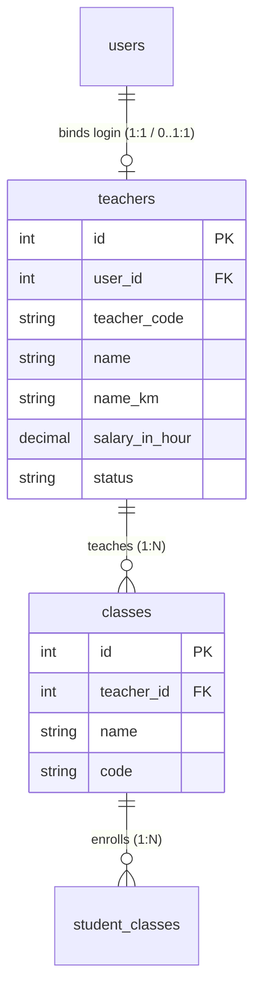

# Feature Spec: Teacher Management, User Account Binding & Class Assignments

## 1. Goal & Context
Build an end-to-end **Teacher Management, User Account Binding & Class Assignment System** across shared contracts (`packages/contracts`), backend API (`apps/api`), and frontend admin web (`apps/web`).

This feature references and migrates legacy schema definitions (`old-schema.txt` table `teachers` and `levels.teacher_id`) into a modern, robust domain model that empowers school administrators to:
1. **Manage Teacher Profiles (CRUD)**: Create, search, filter, paginate, view, update, and soft-delete teacher profiles with full contact details, Khmer names, gender, date of birth, hourly salary rate (`salary_in_hour`), and subject specializations.
2. **Bind / Provision User Accounts for Login**: Link teacher records to system user accounts (`users` table with `userType: CMS` and `roles: ['teacher']`), enabling teachers to log in to both backend APIs and the frontend web portal. Support seamless user account creation during teacher onboarding, as well as binding/unbinding existing user accounts.
3. **Assign Classes to Teachers (1 Teacher to Many Classes, 1 Class to 1 Teacher)**: Assign a teacher to multiple academic classes while enforcing that each class has at most one primary/homeroom teacher (`classes.teacher_id -> teachers.id`). View real-time assigned classes roster and total student headcount on the teacher details view and display the **Assigned Teacher** column in the Academic Classes table.

*(Note: Teacher & Student Attendance / Absences will be implemented in a dedicated Attendance Management feature spec).*

---

## 2. Requirements & Domain Modeling

### 2.1 Database Entities

#### 1. `teachers` Table
*Primary entity representing academic teachers, derived from `old-schema.txt` `teachers` table with enriched personal, contact, employment, and user binding fields.*

| Database Column (`snake_case`) | Type | Nullable | Default | TypeScript Property (`camelCase`) | Description & Legacy Mapping |
| :--- | :--- | :--- | :--- | :--- | :--- |
| `id` | `INT` | NO | AUTO_INCREMENT | `id: number` | Primary key (*legacy `teachers.id`*) |
| `uuid` | `VARCHAR(36)` | NO | (UUIDv4) | `uuid: string` | Unique system UUID |
| `user_id` | `INT` | YES | NULL | `userId?: number \| null` | Foreign Key $\rightarrow$ `users.id` (ON DELETE SET NULL) |
| `teacher_code` | `VARCHAR(50)` | YES | NULL | `teacherCode?: string` | Unique teacher identifier (e.g. `TCH-2026-001`) |
| `name` | `VARCHAR(255)` | NO | NULL | `name: string` | Full English display name (*legacy `teachers.name`*) |
| `name_km` | `VARCHAR(255)` | YES | NULL | `nameKm?: string` | Khmer display name |
| `gender` | `VARCHAR(16)` | NO | 'MALE' | `gender: 'MALE' \| 'FEMALE' \| 'OTHER'` | Gender |
| `date_of_birth` | `VARCHAR(255)` | YES | NULL | `dateOfBirth?: string` | Date of birth |
| `phone` | `VARCHAR(255)` | YES | NULL | `phone?: string` | Primary phone/contact |
| `email` | `VARCHAR(255)` | YES | NULL | `email?: string` | Contact/login email address |
| `salary_in_hour` | `DECIMAL(8,2)` | NO | 0.00 | `salaryInHour: number` | Hourly salary rate (*legacy `teachers.salary_in_hour`*) |
| `specialization` | `VARCHAR(255)` | YES | NULL | `specialization?: string` | Subject/department specialty (e.g. "Mathematics") |
| `bio` | `TEXT` | YES | NULL | `bio?: string` | Biography, background or notes |
| `status` | `VARCHAR(26)` | NO | 'ACTIVE' | `status: string` | `ACTIVE`, `INACTIVE`, `ON_LEAVE`, `ARCHIVED` |
| `created_at` | `DATETIME` | YES | CURRENT_TIMESTAMP | `createdAt?: Date` | Creation timestamp (*legacy `created_at`*) |
| `updated_at` | `DATETIME` | YES | CURRENT_TIMESTAMP | `updatedAt?: Date` | Update timestamp (*legacy `updated_at`*) |
| `deleted_at` | `DATETIME` | YES | NULL | `deletedAt?: Date \| null` | Soft-delete timestamp |

---

### 2.2 Relational Architecture & Constraints

- **One Teacher $\rightarrow$ Multiple Classes**: A teacher entity can be referenced by many classes (`classes.teacher_id`).
- **One Class $\rightarrow$ One Teacher**: Each class row contains a single `teacher_id` column referencing the primary assigned teacher.
- **User Account Binding**: A teacher row contains `user_id`. When created with `createAccount: true`, a corresponding record in `users` table is created with `userType: CMS` and attached role `teacher`. Teachers can authenticate through standard `/api/v1/auth/login`.

---

## 3. Security, RBAC & CASL Architecture

### 3.1 CASL Hook & Filter Hooks
- **`TeacherHook` (`SubjectBeforeFilterHook`)**: Implemented in `apps/api/src/teacher/teacher.hook.ts` to allow CASL to inspect the existing `Teacher` entity on parameterized endpoints (`GET /:id`, `PATCH /:id`, `DELETE /:id`).
- Attached to controller handlers via `@UseAbility(action, Teacher, TeacherHook)`.

### 3.2 Granular Role Precedence in CASL Config
- In `apps/api/src/common/config/casl.config.ts`, `getUserFromRequest` prioritizes assigned granular user `roles` (e.g. `['teacher']`, `['staff']`) over the generic `userType: CMS`.
- This ensures that users with `userType: CMS` and role `teacher` receive strictly `teacher` permissions (e.g. read access to academic resources, no create/update access to programs) without inheriting broad `CMS` manager privileges.

### 3.3 UI Action RBAC Enforcement
- Frontend action buttons (Create, Edit, Delete, Promote) across Teachers, Classes, and Programs feature tables enforce button-level permission guards using `usePermission()`.
- Buttons are disabled with `disabled={!canAction}`, descriptive `title` tooltips, and `disabled:opacity-40 disabled:cursor-not-allowed` styles in compliance with `.agents/skills/react-frontend-best-practices/rules/ui-action-rbac-enforcement.md`.

---

## 4. Tech Design & File Scope

### 4.1 `@repo/contracts`
- `packages/contracts/src/teacher.dto.ts` — Zod schemas (`TeacherSchema`, `CreateTeacherSchema`, `UpdateTeacherSchema`, `FindTeachersSchema`), enums (`TeacherStatusEnum`, `TeacherGenderEnum`), and TypeScript types.
- `packages/contracts/src/class.dto.ts` — Updated `ClassSchema` with `teacher`, `teacherName`, and `teacherId`.
- `packages/contracts/src/route.ts` — `API_ROUTE.TEACHER` route constants (`LIST`, `CREATE`, `GET`, `UPDATE`, `DELETE`, `CLASSES`).
- `packages/contracts/src/resource.enum.ts` — Added `TEACHER = "teacher"`.
- `packages/contracts/src/index.ts` — Re-exports.

### 4.2 `apps/api`
- `apps/api/database/migrations/2026.08.17T03.00.01.create-teachers-table.ts` — Umzug migration for `teachers`.
- `apps/api/database/seeds/2026.08.17T03.00.00.teacher-seeder.ts` — Umzug seeder for realistic teachers with linked user accounts (role `teacher`) and assigned classes.
- `apps/api/src/teacher/entity/teacher.entity.ts` — TypeORM entity for Teacher.
- `apps/api/src/academic/entity/class.entity.ts` — Linked relation to `Teacher`.
- `apps/api/src/teacher/dto/*.ts` — DTOs wrapping contracts via `createZodDto`.
- `apps/api/src/teacher/mapper/teacher.mapper.ts` — Pure mapper.
- `apps/api/src/teacher/teacher.hook.ts` — CASL SubjectBeforeFilterHook.
- `apps/api/src/teacher/teacher.service.ts` — Core business logic for CRUD, user binding, and assigned classes.
- `apps/api/src/teacher/admin.teacher.controller.ts` — REST controller with CASL and JWT guards.
- `apps/api/src/teacher/teacher.permission.ts` — CASL definitions with administrator aliases.
- `apps/api/src/teacher/teacher.module.ts` — Module definition registering `TeacherHook`.
- `apps/api/src/academic/mapper/class.mapper.ts` — Maps attached teacher into `teacher` and `teacherName`.
- `apps/api/src/academic/class.service.ts` — Eagerly joins `class.teacher` in queries.
- `apps/api/src/teacher/teacher.service.spec.ts` — All-condition unit test suite.
- `apps/api/test/teacher.e2e-spec.ts` — All-condition E2E integration test suite with RBAC permission boundaries.

### 4.3 `apps/web`
- `apps/web/src/features/teachers/`
  - `hooks/use-teachers-infinite-query.ts` — Infinite query hook with debounced search, URL filters, and `apiClient`.
  - `hooks/use-teachers-query.ts` — Standard query hook for dropdown selects using `apiClient`.
  - `hooks/use-teacher-detail-query.ts` — Single teacher detail hook using `apiClient`.
  - `hooks/use-teacher-mutations.ts` — Create, update, delete mutations with cache invalidation using `apiClient`.
  - `components/teacher-list-table.tsx` — Responsive data table with search, status filter, user badge, assigned classes count, and RBAC-guarded actions.
  - `components/teacher-form-dialog.tsx` — Multi-section form dialog (Profile, Employment/Salary, User Account Binding/Creation).
  - `components/teacher-detail-dialog.tsx` — Full profile view with assigned classes list, headcount, and linked user login status.
  - `components/delete-teacher-dialog.tsx` — Soft-delete confirmation.
  - `components/teacher-status-badge.tsx` — Status pills.
  - `components/teacher-list-table.spec.tsx` — Component test suite.
  - `index.ts` — Public export.
- `apps/web/src/features/classes/components/class-list-table.tsx` — Added **Assigned Teacher** column with `<UserCheck>` badge and `<UserX>` unassigned state.
- `apps/web/src/features/classes/components/class-form-dialog.tsx` — Teacher selection dropdown to assign teacher to class.
- `apps/web/src/features/admin/components/admin-sidebar.tsx` — Wired Teacher sidebar route under `Users` $\rightarrow$ `Teachers` (`/teachers`).
- `apps/web/src/routes/router.tsx`, `teachers-page.tsx` — Protected routes.

---

## 5. Acceptance Criteria & Verification Matrix

- [x] Database migration executes cleanly (`up` and `down`) with zero regressions.
- [x] Multi-state seed fixtures populated for teachers (`ACTIVE`, `INACTIVE`, `ON_LEAVE`) with linked users and classes.
- [x] Teacher CRUD operates with full search, sorting, and pagination.
- [x] Teacher can be bound to existing user or auto-provisioned a user account with `userType: CMS` and role `teacher`, and log in successfully.
- [x] One teacher can be assigned to multiple classes; a class can have at most one teacher.
- [x] Class list table displays **Assigned Teacher** column and class form supports selecting and assigning a teacher.
- [x] CASL RBAC correctly isolates permissions (teachers can read academic resources but cannot mutate programs).
- [x] Frontend action buttons enforce permission checks with tooltips and disabled states.
- [x] Sidebar displays `Teachers` under `User Management`.
- [x] Backend unit tests pass (63/63).
- [x] Backend E2E tests pass (49/49).
- [x] Frontend tests pass (54/54) and production bundle builds with 0 errors.

---

## 6. Future Roadmap & HR Payroll Integration
- **Staff vs Teacher Domain Boundary**:
  - Non-teaching school staff (administrators, cashiers, registrars, receptionists) are managed directly via `users` with `userType: CMS` and roles (`staff`, `cashier`, `admin`).
  - Academic teaching instructors are managed via `teachers` with hourly rates (`salary_in_hour`), assigned classes, and portal logins.
- **HR Payroll Feature Scope**:
  - The upcoming **HR & Payroll Feature** will consume both `teachers.salary_in_hour` (combined with tracked teaching hours and approved attendance/absences) and staff monthly salaries to compute automated payroll disbursements, pay slips, and financial deductions.
